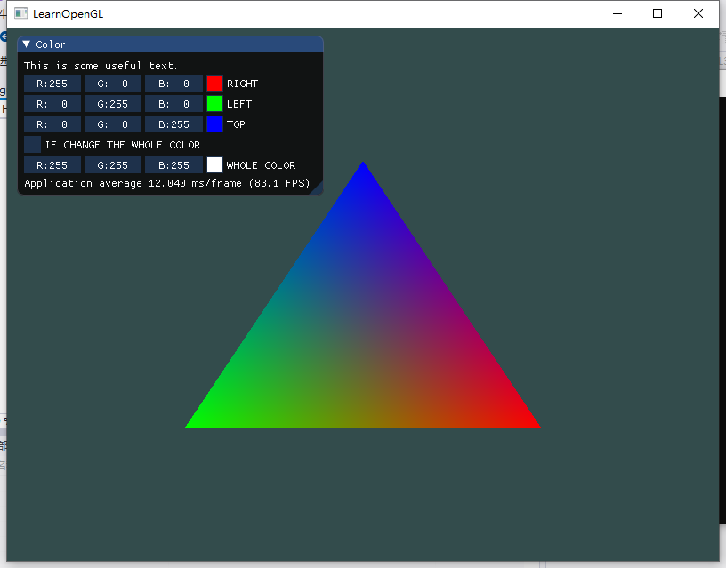
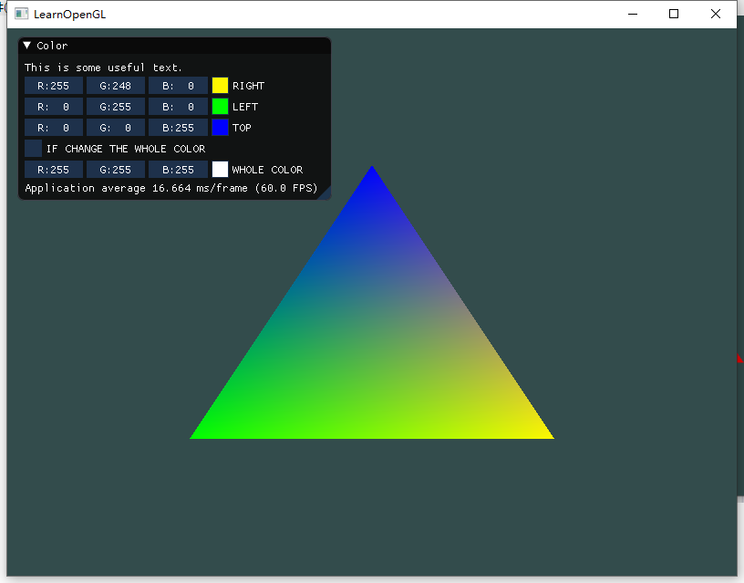
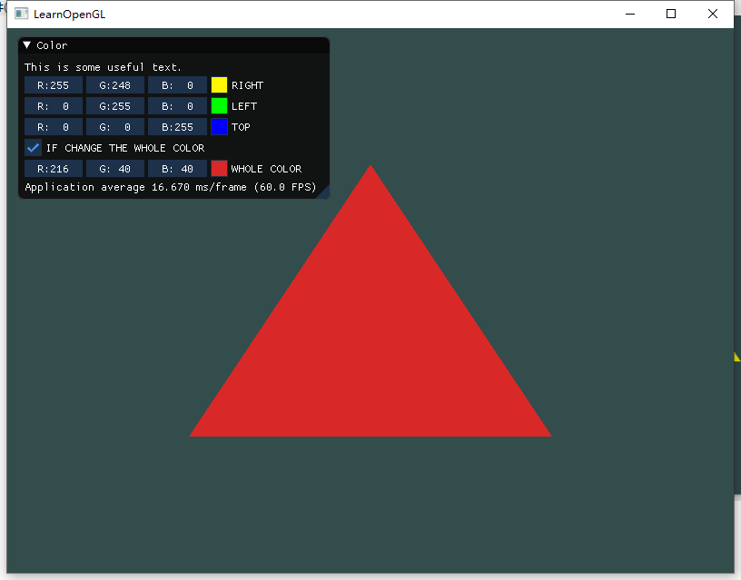

# Homework 2 - GUI and Draw simple graphics 

> 16340011 曾妮 HW2

## 一、安装配置环境

准备以下工具

- Visual Studio 2017
- CMake
- GLFW
- GLAD
- imgui

注意事项：

1. VS2017安装时需要勾选C++相关组件
2. GLFW最好下载32位源码版本
3. cmake编译生成后，新建的项目需要把glfw库链接进去，同时也需要添加imgui的位置


## 二、Homework

> 1. 使用OpenGL(3.3及以上)+GLFW或freeglut画一个简单的三角形。
> 2. 对三角形的三个顶点分别改为红绿蓝，像下面这样。并解释为什么会出现这样的结果。 
> 3. 给上述工作添加一个GUI，里面有一个菜单栏，使得可以选择并改变三角形的颜色。

用OpenGL+GLFW绘制彩色三角形的简单过程如下图：


就本次作业而言，可以简单的解释为，输入顶点数据，编写编译顶点着色器和片段着色器，创建着色器程序，链接顶点属性，生成配置VAO，绘制图像。

首先构建顶点数据：

```c++
float vertices[] = {
    // 位置              // 颜色
    0.5f, -0.5f, 0.0f,  1.0f, 0.0f, 0.0f,   // 右下
    -0.5f, -0.5f, 0.0f,  0.0f, 1.0f, 0.0f,   // 左下
    0.0f,  0.5f, 0.0f,  0.0f, 0.0f, 1.0f    // 顶部
};
```

然后用GLSL语言编写顶点着色器，由于这次的程序比较简单，可以直接存储在字符串中：

```c++
const char *vertexShaderSource = "#version 330 core\n"
    "layout (location = 0) in vec3 aPos;\n"			// 位置变量的属性位置值为 0 
    "layout (location = 1) in vec3 aColor;\n"		// 颜色变量的属性位置值为 1
    "out vec3 ourColor;\n"				// 向片段着色器输出一个颜色
    "void main()\n"
    "{\n"
    "   gl_Position = vec4(aPos, 1.0);\n"
    "   ourColor = aColor;\n"			// 将ourColor设置为我们从顶点数据那里得到的输入颜色
    "}\0";
```

编译：

```c++
// 创建一个着色器对象
unsigned int vertexShader;
vertexShader = glCreateShader(GL_VERTEX_SHADER);
// 把这个着色器源码附加到着色器对象上，然后编译它
glShaderSource(vertexShader, 1, &vertexShaderSource, NULL);
glCompileShader(vertexShader);
```

片段着色器同顶点着色器类似。

创建着色器程序，链接顶点着色器和片段着色器：

```c++
// 着色器程序对象
unsigned int shaderProgram;
shaderProgram = glCreateProgram();
// 把着色器附加到程序对象上并链接
glAttachShader(shaderProgram, vertexShader);
glAttachShader(shaderProgram, fragmentShader);
glLinkProgram(shaderProgram);
```

绑定顶点数据并解析顶点数据：

```c++
// 绑定VAO&VBO
glGenVertexArrays(1, &VAO);
glGenBuffers(1, &VBO);
// 绑定顶点数组对象
glBindVertexArray(VAO);
// 顶点缓冲对象的缓冲类型是GL_ARRAY_BUFFER
// 我们可以使用glBindBuffer函数把新创建的缓冲绑定到GL_ARRAY_BUFFER目标上
glBindBuffer(GL_ARRAY_BUFFER, VBO);
// 把之前定义的顶点数据复制到缓冲的内存中
glBufferData(GL_ARRAY_BUFFER, sizeof(vertices), vertices, GL_STREAM_DRAW);

// 解析顶点数据
// 位置属性
glVertexAttribPointer(0, 3, GL_FLOAT, GL_FALSE, 6 * sizeof(float), (void*)0);
glEnableVertexAttribArray(0);
// 颜色属性
glVertexAttribPointer(1, 3, GL_FLOAT, GL_FALSE, 6 * sizeof(float), (void*)(3 * sizeof(float)));
glEnableVertexAttribArray(1);
```

最后是循环渲染。

---

将顶点分别设置为蓝绿红，为何会出现彩色三角形：

光栅化阶段(Rasterization Stage)，这里它会把图元映射为最终屏幕上相应的像素，生成供片段着色器(Fragment Shader)使用的片段(Fragment)。在片段着色器运行之前会执行裁切(Clipping)。片段着色器的主要目的是计算一个像素的最终颜色，这也是所有OpenGL高级效果产生的地方。通常，片段着色器包含3D场景的数据（比如光照、阴影、光的颜色等等），这些数据可以被用来计算最终像素的颜色。

这里，通过三个顶点的颜色，来计算三角形中每一个片段的颜色，自然而然就产生了渐变的效果，也就形成我们所见到的彩色三角形。

---

imgui的使用，基本上可以参考exmple中的`example_glfw_opengl3`，需要将imgui文件夹以及example文件夹放进包含目录，基本使用方法参考样例。

首先是初始化imgui

```c++
IMGUI_CHECKVERSION();
ImGui::CreateContext();
ImGuiIO& io = ImGui::GetIO(); (void)io;
// Setup Dear ImGui style
ImGui::StyleColorsDark();
//ImGui::StyleColorsClassic();
const char* glsl_version = "#version 130";
// Setup Platform/Renderer bindings
ImGui_ImplGlfw_InitForOpenGL(window, true);
ImGui_ImplOpenGL3_Init(glsl_version);
```

在循环渲染中，创建imgui

```c++
// Start the Dear ImGui frame
ImGui_ImplOpenGL3_NewFrame();
ImGui_ImplGlfw_NewFrame();
ImGui::NewFrame();

{
    ImGui::Begin("Color");
    ImGui::Text("This is some useful text.");// Display some text (you can use a format strings too)
    ImGui::ColorEdit3("RIGHT", (float*)&colors[0]);// Edit 3 floats representing a color
    ImGui::ColorEdit3("LEFT", (float*)&colors[1]);// Edit 3 floats representing a color
    ImGui::ColorEdit3("TOP", (float*)&colors[2]);// Edit 3 floats representing a color

    ImGui::Checkbox("IF CHANGE THE WHOLE COLOR", &if_change_whole);
    ImGui::ColorEdit3("WHOLE COLOR", (float*)&color_whole, 1);
    // Change the color
    // 更改顶点数组数据
    // ...
    ImGui::Text("Application average %.3f ms/frame (%.1f FPS)", 1000.0f / ImGui::GetIO().Framerate, ImGui::GetIO().Framerate);
    ImGui::End();
}
```

在解析顶点数据后，进行渲染：

```c++
ImGui::Render();
ImGui_ImplOpenGL3_RenderDrawData(ImGui::GetDrawData());
```

注：imgui默认使用gl3w，如果我们使用glad的话，需要修改`imgui_impl_opengl3.h`中的defaul loader

```c++
// Set default OpenGL3 loader to be gl3w
#if !defined(IMGUI_IMPL_OPENGL_LOADER_GL3W)     \
 && !defined(IMGUI_IMPL_OPENGL_LOADER_GLEW)     \
 && !defined(IMGUI_IMPL_OPENGL_LOADER_GLAD)     \
 && !defined(IMGUI_IMPL_OPENGL_LOADER_CUSTOM)
#define IMGUI_IMPL_OPENGL_LOADER_GLAD//IMGUI_IMPL_OPENGL_LOADER_GL3W //****修改这里****
#endif
```

## 三、结果贴图

1. 初始界面：



2. 更改其中一个顶点颜色：



3. 更改整个三角形颜色：



