# Homework 3 - Draw line 

>  16340011 曾妮 HW3

### Basic:

1. 使用Bresenham算法(只使用integer arithmetic)画一个三角形边框：input为三个2D点；output三条直线（要 求图元只能用 GL_POINTS ，不能使用其他，比如 GL_LINES 等）。 
2. 使用Bresenham算法(只使用integer arithmetic)画一个圆：input为一个2D点(圆心)、一个integer半径； output为一个圆。
3. 在GUI在添加菜单栏，可以选择是三角形边框还是圆，以及能调整圆的大小(圆心固定即可)。    


### Bresenham算法画直线

**算法描述**

Bresenham直线算法是用来描绘由两点所决定的直线的算法，它会算出一条线段在 n 维光栅上最接近的点。这个算法只会用到较为快速的整数加法、减法和位元移位，常用于绘制电脑画面中的直线。是计算机图形学中最先发展出来的算法。 

我对算法的简单理解：

众所周知，最基本的斜截式直线方程为 y=kx+b(k为斜率,b为截距) 。

如下图，已知斜率m和截距B，由前一点$x_{i}$计算出$x_{i+1}$和$y_{i+1}$

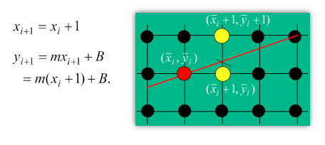

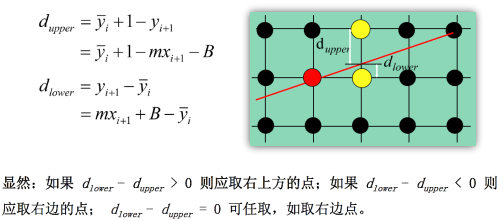

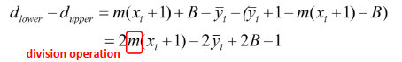

这里有个问题是，k 值是通过除法得出来的，我们知道计算机计算除法都是不精确的，所以这里，我们要做一点处理，来避免除法运算。这里，我们做的是乘以 $\Delta{x}$

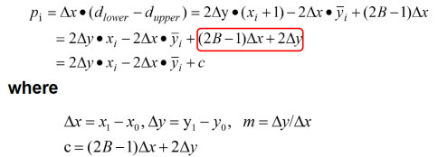

用$p_i$来代替$d_{lower} - d_{upper}$，得到：

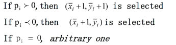

简单的令$ i = 1 $可以求得$p_0$

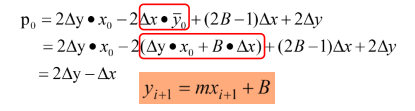

推导出得到

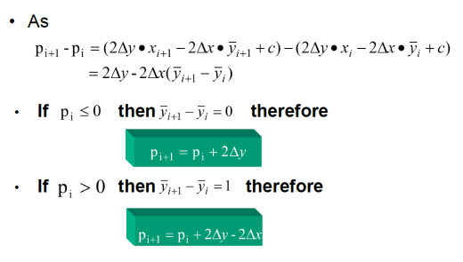

整体算法流程如图：

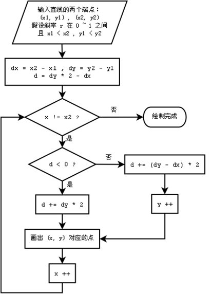


**算法实现**

算法伪代码如下图：

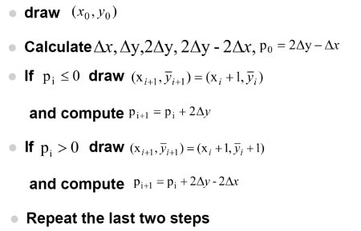

得到程序代码如下：获取两点直线上所有点的位置，存入一个vector容器中并返回该容器。

```c++
vector<int> Bresenham(int x0, int y0, int x1, int y1) {
    vector<int> points;
    points.push_back(x0);
    points.push_back(y0);
    int dx = x1 - x0;
    int dy = y1 - y0;
    int direct_x = dx > 0 ? 1 : -1;
    int direct_y = dy > 0 ? 1 : -1;
    if (dx < 0) dx = -dx;
    if (dy < 0) dy = -dy;
    if (abs(dx) > abs(dy)) {
        int p = 2 * dy - dx;
        int x = x0;
        int y = y0;
        int dy2 = 2 * dy;
        int dy2_sub_dx2 = 2 * dy - 2 * dx;

        while (x != x1) {
            points.push_back(x);
            points.push_back(y);
            if (p > 0) {
                y += direct_y;
                p += dy2_sub_dx2;
            }
            else
            {
                p += dy2;
            }
            x += direct_x;
        }
    }
```

画三角形的的方法同画直线没有区别，只需要重复调用以上算法得到三根直线上所有的点的位置即可。

imgui部分同上一次作业相似，将颜色选取使用的控件改为`ImGui::SliderInt2()`来控制顶点位置即可。

### Bresenham算法画圆

Bresenham画圆算法又称中点画圆算法，与Bresenham 直线算法一样，其基本的方法是利用判别变量来判断选择最近的像素点，判别变量的数值仅仅用一些加、减和移位运算就可以计算出来。为了简便起见，考虑一个圆心在坐标原点的圆，而且只计算八分圆周上的点，其余圆周上的点利用对称性就可得到。 

略去推导过程，简单来说，在画圆算法中

$p_0 = 3 - 2R $

当 $ p_i \geq 0 $ 时，选圆内的点，$ y_{i+1} = y{i} - 1, p_{i+1} = p_i + 4(x_i - y_i) + 10$

当 $p_i \leq 0 $ 时，选圆外的点，$ y_{i+1} = y_i, p_{i+1}  = p_i +4x_i + 6$

递推方式同画直线相似，求出八分之一圆的点的位置，就能得到整个圆的位置。

整体算法流程图如下：

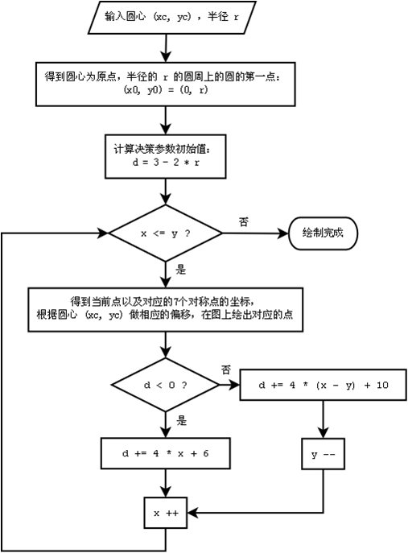

### 结果截图

三角形：

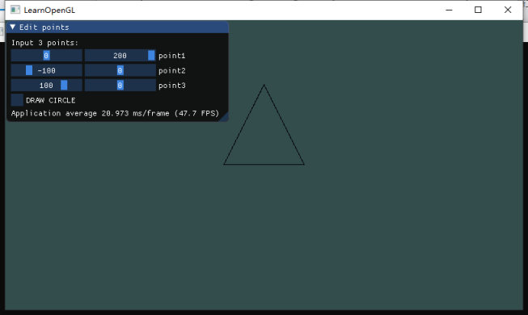

圆：

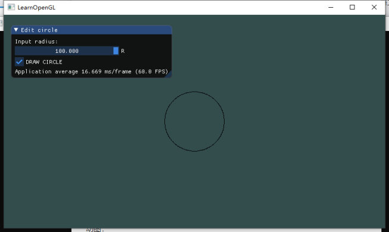

动图：

[demo](demo.gif)

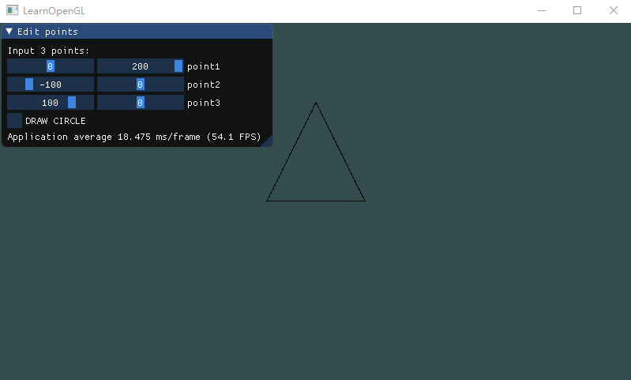

### 参考资料

1. 课件Rasterization
2. [Bresenham 画线算法推导过程](https://blog.csdn.net/sinat_41104353/article/details/82858375 )
3. [Bresenham 画圆算法原理](https://blog.csdn.net/sinat_41104353/article/details/82961824 )
4. [Bresenham直线算法与画圆算法](https://www.cnblogs.com/wlzy/p/8695226.html)