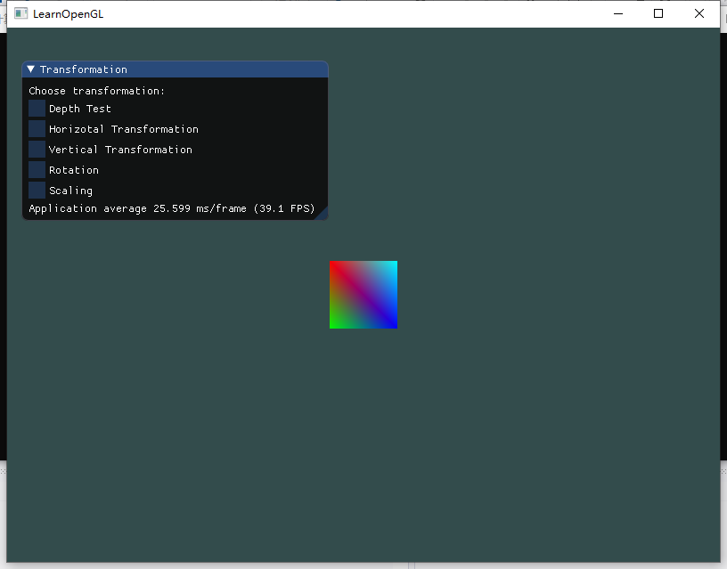
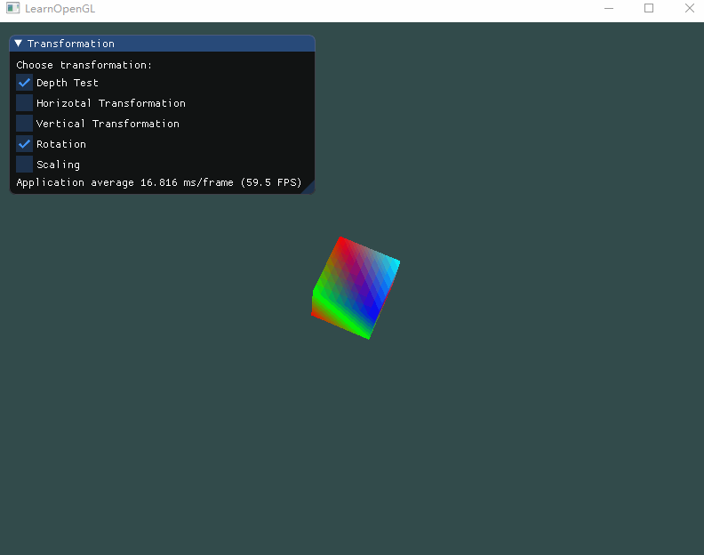
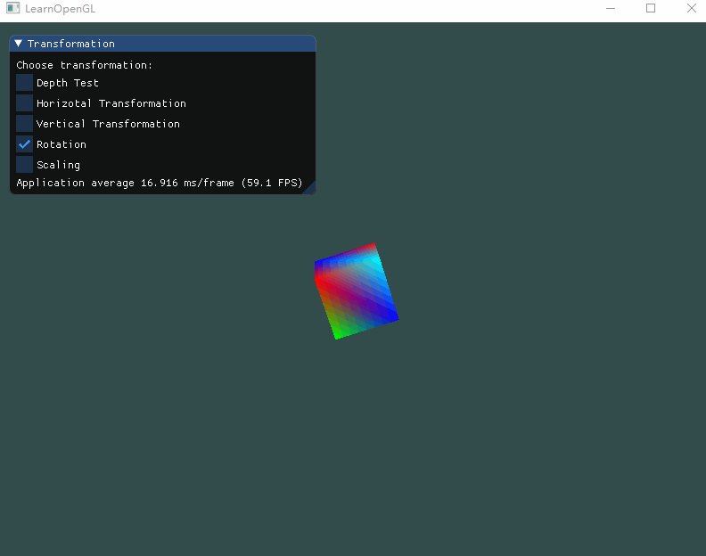
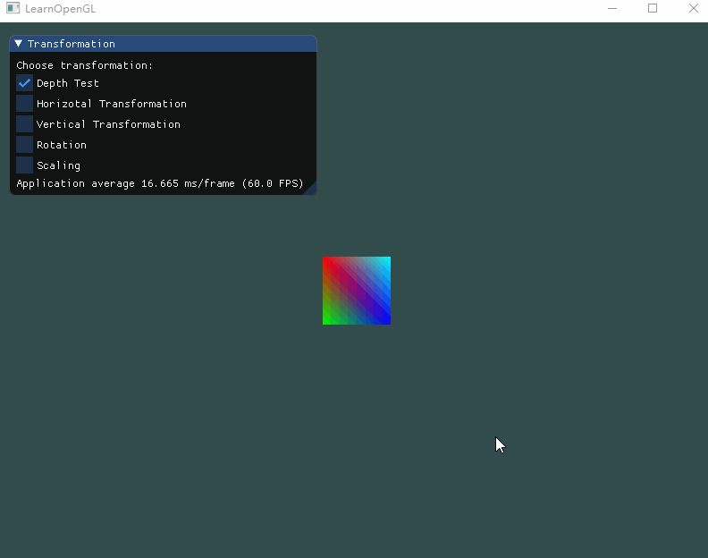
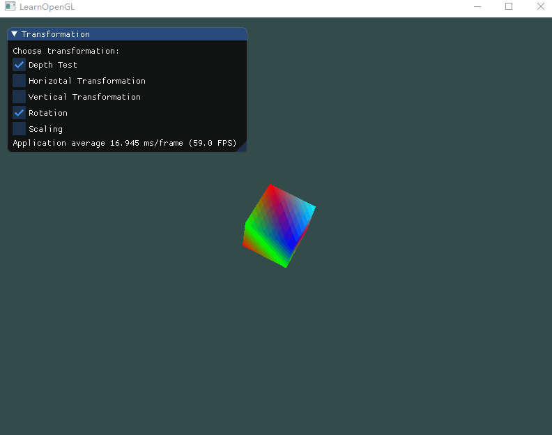
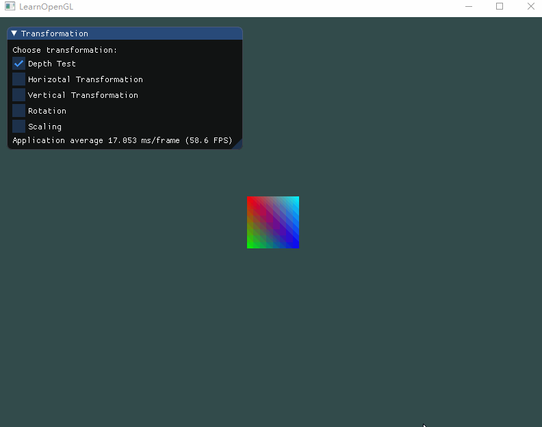

# Homework 4 - Transformation 

> 16340011 曾妮 HW4

## 实验要求

### Basic：

1. 画一个立方体(cube)：边长为4， 中心位置为(0, 0, 0)。分别启动和关闭深度测试 `glEnable(GL_DEPTH_TEST)` 、 `glDisable(GL_DEPTH_TEST) `，查看区别，并分析原因。 
2. 平移(Translation)：使画好的cube沿着水平或垂直方向来回移动。 
3. 旋转(Rotation)：使画好的cube沿着XoZ平面的x=z轴持续旋转。
4. 放缩(Scaling)：使画好的cube持续放大缩小。 
5. 在GUI里添加菜单栏，可以选择各种变换。 
6. 结合Shader谈谈对渲染管线的理解    

Hint: 可以使用GLFW时间函数 `glfwGetTime()` ，或者 `<math.h>` 、 `<time.h>` 等获取不同的数值    


## 实验过程

### 引入GLM库

GLM是Open**GL** **M**athematics的缩写，它是一个**只有头文件的**库，也就是说我们只需包含对应的头文件就行了，不用链接和编译。GLM可以在它们的[网站](https://glm.g-truc.net/0.9.8/index.html)上下载。把头文件的根目录复制到你的**includes**文件夹，然后你就可以使用这个库了。 

```c++
#include <glm/glm.hpp>
#include <glm/gtc/matrix_transform.hpp>
#include <glm/gtc/type_ptr.hpp>
```


### 绘制立方体

首先明确，一个立方体有8个顶点，6个面。众所周知，OpenGL的最小图元是一个三角形，所以我们需要画2 * 6 = 12个三角形，每个三角形3个顶点，所以我们需要输入36个顶点。输入完整36个顶点看起来十分麻烦，所以使用EBO来复用顶点是个更好的选择。

```c++
float vertices[] = {
		// positions			// colors
		-2.0f, -2.0f, -2.0f,	1.0f, 0.0f, 0.0f,
		 2.0f, -2.0f, -2.0f,	0.0f, 1.0f, 0.0f,
		-2.0f,  2.0f, -2.0f,	0.0f, 0.0f, 1.0f,
		 2.0f,  2.0f, -2.0f,	1.0f, 0.0f, 0.0f,

		-2.0f, -2.0f,  2.0f,	0.0f, 1.0f, 0.0f,
		 2.0f, -2.0f,  2.0f,	0.0f, 0.0f, 1.0f,
		-2.0f,  2.0f,  2.0f,	1.0f, 0.0f, 0.0f,
		 2.0f,  2.0f,  2.0f,	0.0f, 1.0f, 1.0f,
	};

	unsigned int indices[] = {
		0, 1, 2,
		1, 2, 3,

		0, 1, 4,
		1, 4, 5,

		0, 2, 4,
		2, 4, 6,

		1, 3, 5,
		3, 5, 7,

		2, 3, 7,
		2, 6, 7,

		4, 5, 6,
		5, 6, 7
	};
```

由于我们复用了顶点，所以在绘制时，不能用

```c++
glBindVertexArray(VAO);
glDrawElements(GL_TRIANGLES, 6, GL_UNSIGNED_INT, 0);
```

而要用

```c++
glBindBuffer(GL_ELEMENT_ARRAY_BUFFER, EBO);
glDrawElements(GL_TRIANGLES, 36, GL_UNSIGNED_INT, 0);
```

> 参考链接：[索引缓冲对象EBO](https://learnopengl-cn.github.io/01%20Getting%20started/04%20Hello%20Triangle/#_10 )

这里由于很多教程都是直接使用VAO的，导致我一开始没有想起来EBO的用法并不一样。


### 设置变换参数 & IMGUI

imgui我们已经很熟了，这里简单的使用了一些bool变量来与imgui的checkbox进行绑定，方便待会进行下一步操作。

```c++
// transformation setting
bool depth_test = false;
bool horizotal_translate = false;
float h_ft = 0.0f;
bool rh = true;
bool vertical_translate = false;
float v_ft = 0.0f;
bool rv = true;
bool rotation = false;
bool scaling = false;
float fs = 1.0f;
bool rs = true;

// imgui
ImGui::Checkbox("Depth Test", &depth_test);
		ImGui::Checkbox("Horizotal Transformation", &horizotal_transformation);
		ImGui::Checkbox("Vertical Transformation", &vertical_transformation);
		ImGui::Checkbox("Rotation", &rotation);
		ImGui::Checkbox("Scaling", &scaling);
```


### 进入3D

到这里其实就已经可以运行起来看一看立方体是否正确显示出来了，但是我们会发现，立方体并不能在窗口中显示出来。这是因为，我们创建的 3D 物体默认在世界坐标的原点(0, 0, 0)，而摄像机的位置也是(0, 0, 0)，所以我们无法看到这个3D物体。

这时，为了能看清楚3D物体的全貌，我们需要引入一个观察矩阵。我们想要在场景里面稍微往后移动，以使得物体变成可见的。由于**将摄像机向后移动，和将整个场景向前移动是一样的**，所以观察矩阵定义如下。

```c++
glm::mat4 view = glm::mat4(1.0f);
view = glm::translate(view, glm::vec3(0.0f, 0.0f, -40.0f));
```

最后我们需要做的是定义一个投影矩阵。我们希望在场景中使用透视投影，所以像这样声明一个投影矩阵：

```c++
glm::mat4 projection;
projection = glm::perspective(glm::radians(45.0f), screenWidth / screenHeight, 0.1f, 100.0f);
```

最后是一个变换矩阵，之后实现平移、旋转和缩放时会用到。

```c++
glm::mat4 model = glm::mat4(1.0f);
```

同时，修改顶点着色器，设置这三个矩阵为`uniform`

```c++
#version 330 core
layout (location = 0) in vec3 aPos;		// 位置变量的属性位置值为 0 
layout (location = 1) in vec3 aColor;	// 颜色变量的属性位置值为 1

out vec3 ourColor;	// 向片段着色器输出一个颜色

uniform mat4 model;
uniform mat4 view;
uniform mat4 projection;

void main()
{
	gl_Position = projection * view * model * vec4(aPos, 1.0);
	ourColor = aColor; // 将ourColor设置为我们从顶点数据那里得到的输入颜色
}
```

之后我们可以通过调用以下函数修改这三个矩阵（主要是变换矩阵model）的数值：

```c++
int modelLoc = glGetUniformLocation(ourShader.ID, "model"));
glUniformMatrix4fv(modelLoc, 1, GL_FALSE, glm::value_ptr(model));
```

以上，我们就能成功画出一个立方体了，显示出来如下图：



这是从正面看的图，故而看起来只是一个正方形，待会转起来就知道它是一个立方体了。


### 问题解答 & 实现效果

1. 画一个立方体(cube)：边长为4， 中心位置为(0, 0, 0)。分别启动和关闭深度测试 `glEnable(GL_DEPTH_TEST)` 、 `glDisable(GL_DEPTH_TEST) `，查看区别，并分析原因。 

   - 开启深度测试

     [EnableDepthTest](EnableDepthTest.gif)

     

   - 关闭深度测试

     [DisableDepthTest](DisableDepthTest.gif)

     

   - 关闭深度测试时，立方体的某些本应被遮挡住的面被绘制在了这个立方体其他面之上。之所以这样是因为OpenGL是一个三角形一个三角形地来绘制你的立方体的，所以即便之前那里有东西它也会覆盖之前的像素。因为这个原因，有些三角形会被绘制在其它三角形上面，虽然它们本不应该是被覆盖的。 

   - OpenGL存储它的所有深度信息于一个Z缓冲(Z-buffer)中，也被称为深度缓冲(Depth Buffer)。GLFW会自动为你生成这样一个缓冲（就像它也有一个颜色缓冲来存储输出图像的颜色）。深度值存储在每个片段里面（作为片段的**z**值），当片段想要输出它的颜色时，OpenGL会将它的深度值和z缓冲进行比较，如果当前的片段在其它片段之后，它将会被丢弃，否则将会覆盖。这个过程称为深度测试(Depth Testing)，它是由OpenGL自动完成的。 

     > 想要深度测试生效，需要在循环渲染中注意清除深度缓冲信息，这跟之前我们清除颜色缓冲是一样的，调用：
     >
     > `glClear(GL_COLOR_BUFFER_BIT | GL_DEPTH_BUFFER_BIT); `

2. 平移(Translation)：使画好的cube沿着水平或垂直方向来回移动。 

   之前在变换参数设置中我们已经设置好了平移参数，包括是否平移，平移量，和是否反向，之后再循环渲染中进行一些判断即可。

   ```c++
   if (horizotal_translate) {
       if (h_ft < 12.0f && rh) {
           h_ft += 0.1f;
           model = glm::translate(model, glm::vec3(h_ft, 0.0f, 0.0f));
       }
       else {
           rh = h_ft < -12.0f;
           h_ft -= 0.1f;
           model = glm::translate(model, glm::vec3(h_ft, 0.0f, 0.0f));
       }
   }
   else { 
       h_ft = 0.0f; 
       rh = true;
   }
   
   if (vertical_translate) {
       if (v_ft < 12.0f && rv) {
           v_ft += 0.1f;
           model = glm::translate(model, glm::vec3(0.0f, v_ft, 0.0f));
       }
       else {
           rv = v_ft < -12.0f;
           v_ft -= 0.1f;
           model = glm::translate(model, glm::vec3(0.0f, v_ft, 0.0f));				
       }
   }
   else {
       v_ft = 0.0f;
       rv = true;
   }
   ```

   - 实现效果：

     - 水平平移：

       [HTranslate](HTranslate.gif)

       

     - 垂直平移：

       [VTranslate](VTranslate.gif)

       

   

3. 旋转(Rotation)：使画好的cube沿着XoZ平面的x=z轴持续旋转。

   根据`glfwGetTime()`来控制旋转角度，沿x=z轴旋转。

   ```c++
   if (rotation) {
       model = glm::rotate(model, (float)glfwGetTime(), glm::vec3(1.0f, 0.0f, 1.0f));
   }
   ```

   实现效果：向上查看深度测试对比效果图。

4. 放缩(Scaling)：使画好的cube持续放大缩小。 

   同平移类似，通过参数`fs`来控制缩放比例，通过参数`rs`来控制增加还是减少`fs`。

   ```c++
   if (scaling) {
       if (fs < 3.0f && rs) {
           fs += 0.01f;
           model = glm::scale(model, glm::vec3(fs, fs, fs));
       }
       else {
           rs = fs < 0.1f;
           fs -= 0.01f;
           model = glm::scale(model, glm::vec3(fs, fs, fs));
       }
   }
   else {
       fs = 1.0f;
       rs = true;
   }
   ```

   实现效果：

   [Scaling](Scaling.gif)

   

5. 在GUI里添加菜单栏，可以选择各种变换。 

   上文已有提及，imgui刚开始使用的时候不是很会，经过几次作业我们已经能够比较熟练的操作了。这次只使用到了checkbox，十分方便。

6. 结合Shader谈谈对渲染管线的理解

   - Shader，中文翻译即着色器，是一种较为短小的程序片段，用于告诉图形硬件如何计算和输出图像，过去由汇编语言来编写，现在也可以使用高级语言来编写。一句话概括：Shader是可编程图形管线的算法片段。它主要分为两类：Vertex Shader和Fragment Shader。 

   - 渲染管线也称为渲染流水线，是显示芯片内部处理图形信号相互独立的并行处理单元。一个流水线是一序列可以并行和按照固定顺序进行的阶段。就像一个在同一时间内，不同阶段不同的汽车一起制造的装配线，传统的图形硬件流水线以流水的方式处理大量的顶点、几何图元和片段。 

   - 回忆这张图形渲染管线的每个阶段的抽象展示图：

     

     我们就会发现，在渲染管线流程中，由**顶点数据**经**顶点着色器**绘制顶点，然后进行**图元装配(VAO,VBO,EBO)**，**几何着色器**把图元形式的一系列顶点的集合作为输入，它可以通过产生新顶点构造出新的（或是其它的）图元来生成其他形状。 几何着色器的输出会被传入**光栅化阶段**，这里它会把图元映射为最终屏幕上相应的像素，生成供**片段着色器**使用的片段。在片段着色器运行之前会执行裁切。裁切会丢弃超出你的视图以外的所有像素，用来提升执行效率。**片段着色器**的主要目的是计算一个像素的最终颜色。在所有对应颜色值确定以后，最终的对象将会被传到最后一个阶段，我们叫做**Alpha测试和混合阶段**。这个阶段检测片段的对应的深度值，用它们来判断这个像素是其它物体的前面还是后面，决定是否应该丢弃。这个阶段也会检查alpha值（alpha值定义了一个物体的透明度）并对物体进行混合。 

     在现代OpenGL中，我们**必须**定义至少一个顶点着色器和一个片段着色器，所以Shader是渲染管线非常重要的一部分。

     

### 综合效果

十分有趣！

[Composite](Composite.gif)




## References

- [进入3D](https://learnopengl-cn.github.io/01%20Getting%20started/08%20Coordinate%20Systems/#3d )
- [Shader编程学习笔记（二）—— Shader和渲染管线](https://www.cnblogs.com/maple-share/p/5395097.html)
- [glm](https://learnopengl-cn.github.io/01%20Getting%20started/07%20Transformations/#glm )

