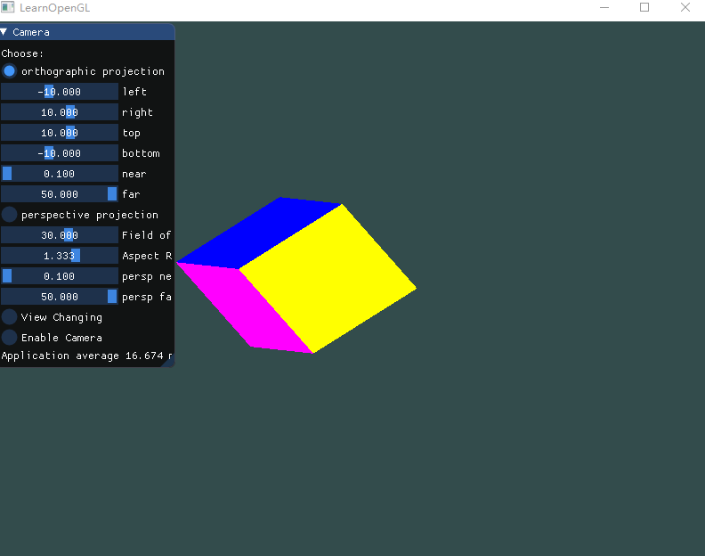
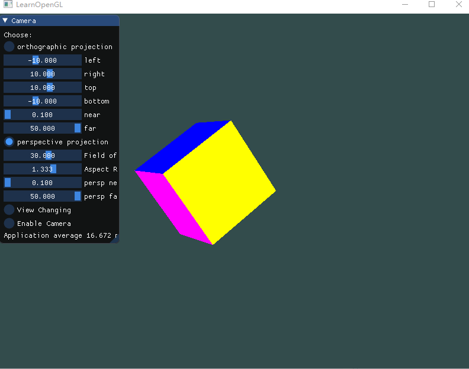
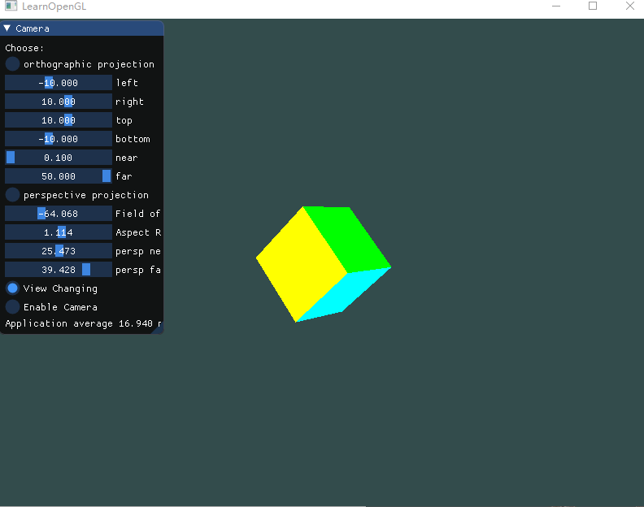
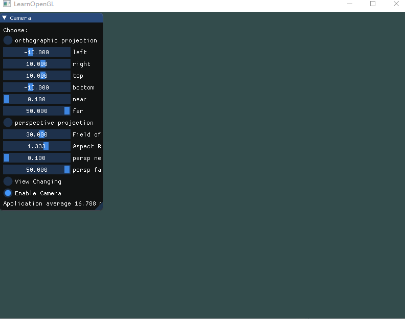

# Homework 5 - Camera

> 16340011 曾妮 HW5

## 实验要求

### Basic: 

1. 投影(Projection): 

   - 把上次作业绘制的cube放置在(-1.5, 0.5, -1.5)位置，要求6个面颜色不一致 
   - 正交投影(orthographic projection)：实现正交投影，使用多组(left, right, bottom, top, near, far)参数， 比较结果差异 
   - 透视投影(perspective projection)：实现透视投影，使用多组参数，比较结果差异 

2. 视角变换(View Changing): 

   - 把cube放置在(0, 0, 0)处，做透视投影，使摄像机围绕cube旋转，并且时刻看着cube中心 

3. 在GUI里添加菜单栏，可以选择各种功能。 *Hint:* 使摄像机一直处于一个圆的位置，可以参考以下公式： 

   ```c++
   camPosX=sin(clock()/1000.0)*Radius;
   camPosZ=cos(clock()/1000.0)*Radius;
   ```

   原理很容易理解，由于圆的公式 `a^2+b^2=1` ，以及有 `sin(x)^2+cos(x)^2=1` ，所以能保证摄像机在XoZ平面的 一个圆上。 

4. 在现实生活中，我们一般将摄像机摆放的空间**View matrix**和被拍摄的物体摆设的空间**Model matrix**分开，但是在OpenGL中却将两个合二为一设为**ModelView matrix**，通过上面的作业启发，你认为是为什么呢？在报 告中写入。（Hints：你可能有不止一个摄像机）    

### Bonus: 

1. 实现一个camera类，当键盘输入 `w,a,s,d` ，能够前后左右移动；当移动鼠标，能够视角移动("look around")， 即类似FPS(First Person Shooting)的游戏场景    


## 实验过程

### 绘制六面不同色立方体

上次作业绘制立方体时，我使用EBO来存储顶点数据，只用了8个顶点，8种颜色，绘制出来的立方体每个面都是四色渐变，但这次作业要求6个面不同颜色， ~~（其实每个面都是四色渐变其实也是不一样的嘛）~~尝试了很久也没有找到仅用8种顶点数据绘制每个面都是单色的6色立方体的方法，所以改成了用VAO，顶点数据如下：

```c++
float vertices[] = {
		// positons				// colors
	   -2.0f, -2.0f, -2.0f,		1.0f, 0.0f, 0.0f,
		2.0f, -2.0f, -2.0f,		1.0f, 0.0f, 0.0f,
		2.0f,  2.0f, -2.0f,		1.0f, 0.0f, 0.0f,
		2.0f,  2.0f, -2.0f,		1.0f, 0.0f, 0.0f,
	   -2.0f,  2.0f, -2.0f,		1.0f, 0.0f, 0.0f,
	   -2.0f, -2.0f, -2.0f,		1.0f, 0.0f, 0.0f,

	   -2.0f, -2.0f,  2.0f,		1.0f, 1.0f, 0.0f,
		2.0f, -2.0f,  2.0f,		1.0f, 1.0f, 0.0f,
		2.0f,  2.0f,  2.0f,		1.0f, 1.0f, 0.0f,
		2.0f,  2.0f,  2.0f,		1.0f, 1.0f, 0.0f,
	   -2.0f,  2.0f,  2.0f,		1.0f, 1.0f, 0.0f,
	   -2.0f, -2.0f,  2.0f,		1.0f, 1.0f, 0.0f,

	   -2.0f,  2.0f,  2.0f,		1.0f, 0.0f, 1.0f,
	   -2.0f,  2.0f, -2.0f,		1.0f, 0.0f, 1.0f,
	   -2.0f, -2.0f, -2.0f,		1.0f, 0.0f, 1.0f,
	   -2.0f, -2.0f, -2.0f,		1.0f, 0.0f, 1.0f,
	   -2.0f, -2.0f,  2.0f,		1.0f, 0.0f, 1.0f,
	   -2.0f,  2.0f,  2.0f,		1.0f, 0.0f, 1.0f,

		2.0f,  2.0f,  2.0f,		0.0f, 1.0f, 0.0f,
		2.0f,  2.0f, -2.0f,		0.0f, 1.0f, 0.0f,
		2.0f, -2.0f, -2.0f,		0.0f, 1.0f, 0.0f,
		2.0f, -2.0f, -2.0f,		0.0f, 1.0f, 0.0f,
		2.0f, -2.0f,  2.0f,		0.0f, 1.0f, 0.0f,
		2.0f,  2.0f,  2.0f,		0.0f, 1.0f, 0.0f,

	   -2.0f, -2.0f, -2.0f,		0.0f, 1.0f, 1.0f,
		2.0f, -2.0f, -2.0f,		0.0f, 1.0f, 1.0f,
		2.0f, -2.0f,  2.0f,		0.0f, 1.0f, 1.0f,
		2.0f, -2.0f,  2.0f,		0.0f, 1.0f, 1.0f,
	   -2.0f, -2.0f,  2.0f,		0.0f, 1.0f, 1.0f,
	   -2.0f, -2.0f, -2.0f,		0.0f, 1.0f, 1.0f,

	   -2.0f,  2.0f, -2.0f,		0.0f, 0.0f, 1.0f,
		2.0f,  2.0f, -2.0f,		0.0f, 0.0f, 1.0f,
		2.0f,  2.0f,  2.0f,		0.0f, 0.0f, 1.0f,
		2.0f,  2.0f,  2.0f,		0.0f, 0.0f, 1.0f,
	   -2.0f,  2.0f,  2.0f,		0.0f, 0.0f, 1.0f,
	   -2.0f,  2.0f, -2.0f,		0.0f, 0.0f, 1.0f,
	};
```

顶点着色器和片段着色器同上次作业一样。


### 设置变换参数 & IMGUI

首先，定义一个全局变量`choice`，代表选择的表现方法，对应正交投影，透视投影，视角变换，和使用摄像机类。

```c++
// 0 - orthographic projection
// 1 - perspective projection
// 2 - View Changing
// 3 - camera
int choice = 0;
```

然后是正交投影和透视投影的可控参数：

```c++
// settings
float ortho_left = -10.0f;
float ortho_right = 10.0f;
float ortho_bottom = -10.0f;
float ortho_top = 10.0f;
float ortho_near = 0.1f;
float ortho_far = 50.0f;

float fov_radius = 30.0f;
float persp_near = 0.1f;
float persp_far = 50.0f;
```

imgui与这些参数进行绑定

```c++
ImGui::RadioButton("orthographic projection", &choice, 0);
ImGui::SliderFloat("left", &ortho_left, -50.0f, 50.f);
ImGui::SliderFloat("right", &ortho_right, -50.0f, 50.f);
ImGui::SliderFloat("top", &ortho_top, -50.0f, 50.f);
ImGui::SliderFloat("bottom", &ortho_bottom, -50.0f, 50.f);
ImGui::SliderFloat("near", &ortho_near, 0.1f, 50.0f);
ImGui::SliderFloat("far", &ortho_far, 0.1f, 50.0f);

ImGui::RadioButton("perspective projection", &choice, 1);
ImGui::SliderFloat("Field of View", &fov_radius, -180.0f, 180.0f);
ImGui::SliderFloat("persp near", &persp_near, 0.1f, 50.0f);
ImGui::SliderFloat("persp far", &persp_far, 0.1f, 50.0f);

ImGui::RadioButton("View Changing", &choice, 2);
ImGui::RadioButton("Enable Camera", &choice, 3);
```


### 正交投影

正射投影矩阵定义了一个类似立方体的平截头箱，它定义了一个裁剪空间，在这空间之外的顶点都会被裁剪掉。 它的平截头体看起来像一个容器： 


上面的平截头体定义了可见的坐标，它由由宽、高、近(Near)平面和远(Far)平面所指定。任何出现在近平面之前或远平面之后的坐标都会被裁剪掉。 

要创建一个正射投影矩阵，我们可以使用GLM的内置函数`glm::ortho`：

```
glm::ortho(0.0f, 800.0f, 0.0f, 600.0f, 0.1f, 100.0f);
```

前两个参数指定了平截头体的左右坐标，第三和第四参数指定了平截头体的底部和顶部。通过这四个参数我们定义了近平面和远平面的大小，然后第五和第六个参数则定义了近平面和远平面的距离。这个投影矩阵会将处于这些x，y，z值范围内的坐标变换为标准化设备坐标。

在我们的作业中，当用户选择正交投影时，`choice = 0`，我们的投影矩阵将使用`glm::ortho`来获得：

```c++
if (choice == 0) {
    projection = glm::ortho(ortho_left, ortho_right, ortho_bottom, ortho_top, ortho_near, ortho_far);
}
```

**变换参数效果如下：**



可以看出，当调节前四个参数时，由于截取空间大小的变化，立方体被拉大或者压缩，这是因为，所截取的空间范围缩小时，立方体的占比变大，被拉大；所截取的空间范围变大时，立方体的占比变小，被压缩。当调节后两个参数时，调节near参数，近平面位置变大时，会截取不到前面位置比它小的点，所以我们能看到立方体内部另外几个面的颜色。调节far参数，远平面位置变小，会截取不到后面位置比它大的点，所以我们立方体后半部分消失了。


### 透视投影

在实际生活中，我们能体会到，离你越远的东西看起来更小。这个奇怪的效果称之为透视(Perspective)。

在GLM中可以这样创建一个透视投影矩阵：

```
glm::mat4 proj = glm::perspective(glm::radians(45.0f), (float)width/(float)height, 0.1f, 100.0f);
```

同样，`glm::perspective`所做的其实就是创建了一个定义了可视空间的大**平截头体**，任何在这个平截头体以外的东西最后都不会出现在裁剪空间体积内，并且将会受到裁剪。一个透视平截头体可以被看作一个不均匀形状的箱子，在这个箱子内部的每个坐标都会被映射到裁剪空间上的一个点。下面是一张透视平截头体的图片： 


它的第一个参数定义了fov的值，它表示的是视野(Field of View)，并且设置了观察空间的大小。如果想要一个真实的观察效果，它的值通常设置为45.0f，但想要一个末日风格的结果你可以将其设置一个更大的值。第二个参数设置了宽高比，由视口的宽除以高所得。第三和第四个参数设置了平截头体的**近**和**远**平面。我们通常设置近距离为0.1f，而远距离设为100.0f。所有在近平面和远平面内且处于平截头体内的顶点都会被渲染。 

在我们的作业中，当用户选择正交投影时，`choice = 1`，我们的投影矩阵将使用`glm::perspective`来获得：

```c++
else if (choice == 1) {
    projection = glm::perspective(glm::radians(fov_radius), (float)SCR_WIDTH / (float)SCR_HEIGHT, persp_near, persp_far);
}
```

**变换参数效果如下：**



可以看出，第一个参数FOV，也就是视野，增大时，虽然立方体大小不变，但是视野增大导致立方体占比变小所以视觉上，立方体缩小了。第二个参数代表宽高比，一般是窗口宽高比，代表水平拉伸程度。最后两个参数近平面和远平面同正交投影类似。


### 视角变换

要实现视角变换的效果，我们需要了解一下观察空间。

当我们讨论**摄像机/观察空间(Camera/View Space)**的时候，是在讨论以摄像机的视角作为场景原点时场景中所有的顶点坐标：观察矩阵把所有的世界坐标变换为相对于摄像机位置与方向的观察坐标。**要定义一个摄像机，我们需要它在世界空间中的位置、观察的方向、一个指向它右测的向量以及一个指向它上方的向量。** 


**1. 摄像机位置**

摄像机位置简单来说就是世界空间中一个指向摄像机位置的向量，比如在本次作业中，我们只需要将摄像机从(0, 0, 0)向z轴正方向移动一点即可。

```s++
glm::vec3 cameraPos = glm::vec3(0.0f, 0.0f, 30.0f);
```

**2. 摄像机方向**

摄像机的方向，这里指的是摄像机指向哪个方向。在本次作业视角变换这个场景中，立方体位于(0, 0, 0)，所以我们让摄像机指向场景原点：(0, 0, 0)。将这个向量同摄像机位置相减，就能得到摄像机方向。

```c++
glm::vec3 cameraTarget = glm::vec3(0.0f, 0.0f, 0.0f);
glm::vec3 cameraDirection = glm::normalize(cameraPos - cameraTarget);
```

> **方向**向量(Direction Vector)并不是最好的名字，因为它实际上指向从它到目标向量的相反方向（译注：注意看前面的那个图，蓝色的方向向量大概指向z轴的正方向，与摄像机实际指向的方向是正好相反的）。 

所以，实际上，摄像机方向指的是从摄像机目标指向摄像机的方法。

**3. 右轴**

我们需要的另一个向量是一个**右向量**(Right Vector)，它代表摄像机空间的x轴的正方向。为获取右向量我们需要先使用一个小技巧：先定义一个**上向量**(Up Vector)。

> 这个上向量其实可以简单地认为是世界坐标的上轴，即y轴

接下来把上向量和第二步得到的方向向量进行叉乘。两个向量叉乘的结果会同时垂直于两向量，因此我们会得到指向x轴正方向的那个向量（如果我们交换两个向量叉乘的顺序就会得到相反的指向x轴负方向的向量）：

```c++
glm::vec3 up = glm::vec3(0.0f, 1.0f, 0.0f); 
glm::vec3 cameraRight = glm::normalize(glm::cross(up, cameraDirection));
```

**4. 上轴**

现在我们已经有了x轴向量和z轴向量，获取一个指向摄像机的正y轴向量就相对简单了：我们把右向量和方向向量进行叉乘：

```c++
glm::vec3 cameraUp = glm::cross(cameraDirection, cameraRight);
```

如此一个摄像机就完成了，我们可以利用这些参数来获取view矩阵了。

**Look At**

使用矩阵的好处之一是如果你使用3个相互垂直（或非线性）的轴定义了一个坐标空间，你可以用这3个轴外加一个平移向量来创建一个矩阵，并且你可以用这个矩阵乘以任何向量来将其变换到那个坐标空间。这正是**LookAt**矩阵所做的，现在我们有了3个相互垂直的轴和一个定义摄像机空间的位置坐标，我们可以创建我们自己的LookAt矩阵了： 


$$
LookAt = \begin{bmatrix} \color{red}{R_x} & \color{red}{R_y} & \color{red}{R_z} & 0 \\ \color{green}{U_x} & \color{green}{U_y} & \color{green}{U_z} & 0 \\ \color{blue}{D_x} & \color{blue}{D_y} & \color{blue}{D_z} & 0 \\ 0 & 0 & 0  & 1 \end{bmatrix} * \begin{bmatrix} 1 & 0 & 0 & -\color{purple}{P_x} \\ 0 & 1 & 0 & -\color{purple}{P_y} \\ 0 & 0 & 1 & -\color{purple}{P_z} \\ 0 & 0 & 0  & 1 \end{bmatrix}
$$
其中$ \color{red}R$是右向量，$ \color{Green}U$是上向量，$ \color{blue}D$是方向向量，$ \color{purple}P$是摄像机位置向量。 注意，位置向量是相反的，因为我们最终希望把世界平移到与我们自身移动的相反方向。把这个LookAt矩阵作为观察矩阵可以很高效地把所有世界坐标变换到刚刚定义的观察空间。LookAt矩阵就像它的名字表达的那样：它会创建一个看着(Look at)给定目标的观察矩阵。 

GLM提供了一个`lookAt`函数，需要的参数分别是**摄像机位置**，**目标位置**和**上向量**。

所以在本次作业中，当用户选择视角变换时，我们的view矩阵获取方式如下：

```c++
else if (choice == 2) {
    // 把cube放置在(0, 0, 0)处
    model = glm::mat4(1.0f);
    // 使摄像机围绕cube旋转，并且时刻看着cube中心
    float radius = 30.0f;
    float camX = sin(glfwGetTime()) * radius;
    float camZ = cos(glfwGetTime()) * radius;
    view = glm::lookAt(glm::vec3(camX, 0.0, camZ), glm::vec3(0.0, 0.0, 0.0), glm::vec3(0.0, 1.0, 0.0));
}
```

原理很容易理解，由于圆的公式 `a^2+b^2=1` ，以及有 `sin(x)^2+cos(x)^2=1` ，所以能保证摄像机在XoZ平面的一个圆上。

**实现效果：**




### Camera类

前面介绍摄像机空间时已经说明了如何定义一个摄像机，只需要将其封装在一个类中就可以实现Camera类了。但是，其中的摄像机方向，如何在不定义摄像机目标的情况下获取，并且变换，这就需要引入视角了。

**欧拉角 (Euler Angle)**

欧拉角(Euler Angle)是可以表示3D空间中任何旋转的3个值，由莱昂哈德·欧拉(Leonhard Euler)在18世纪提出。一共有3种欧拉角：俯仰角(Pitch)、偏航角(Yaw)和滚转角(Roll)，下面的图片展示了它们的含义： 


俯仰角是描述我们如何往上或往下看的角，可以在第一张图中看到。第二张图展示了偏航角，偏航角表示我们往左和往右看的程度。滚转角代表我们如何**翻滚**摄像机，通常在太空飞船的摄像机中使用。每个欧拉角都有一个值来表示，把三个角结合起来我们就能够计算3D空间中任何的旋转向量了。

对于我们的摄像机系统来说，我们只关心俯仰角和偏航角，所以我们不会讨论滚转角。给定一个俯仰角和偏航角，我们可以把它们转换为一个代表新的方向向量的3D向量。

|                        俯仰角(Pitch)                         |                         偏航角(Yaw)                          |
| :----------------------------------------------------------: | :----------------------------------------------------------: |
|  |  |

由图中可以看出，利用一些三角函数的知识，我们能够得到摄像机方向向量如下：

```c++
direction.x = cos(glm::radians(pitch)) * cos(glm::radians(yaw)); 
// 译注：direction代表摄像机的前轴(Front)，这个前轴是和本文第一幅图片的第二个摄像机的方向向量是相反的
// 即，这是摄像机指向摄像机目标的方向向量
direction.y = sin(glm::radians(pitch));
direction.z = cos(glm::radians(pitch)) * sin(glm::radians(yaw));
```

接下来我们就能具体地去实现摄像机类了。

**Camera类 基本参数与功能**

首先，我们需要定义一些参数，包括定义摄像机必须的**摄像机在世界空间中的位置、观察的方向、一个指向它右测的向量以及一个指向它上方的向量**，其中，我们需要一个**世界坐标的上向量**，用来计算摄像机的右轴和上轴。同时引入视角后，摄像机类还包括欧拉角中的**俯仰角和偏航角**。

故而，摄像机类的参数和构造函数如下：

```c++
// Camera Attributes
glm::vec3 Position; //	摄像机位置
glm::vec3 Front;	//	摄像机方向
glm::vec3 Up;		//	摄像机上轴
glm::vec3 Right;	//	摄像机右轴
glm::vec3 WorldUp;	//	世界坐标的上向量
// Euler Angles
float Yaw;			//	偏航角
float Pitch;		//	俯仰角

Camera::Camera(glm::vec3 position, glm::vec3 up, float yaw, float pitch) : Front(glm::vec3(0.0f, 0.0f, -1.0f)), MovementSpeed(SPEED), MouseSensitivity(SENSITIVITY), Zoom(ZOOM)
{
	Position = position;
	WorldUp = up;
	Yaw = yaw;
	Pitch = pitch;
	updateCameraVectors();
}
```

更新摄像机右轴和上轴的函数：

```c++
void Camera::updateCameraVectors()
{
	glm::vec3 front;
	front.x = cos(glm::radians(Yaw)) * cos(glm::radians(Pitch));
	front.y = sin(glm::radians(Pitch));
	front.z = sin(glm::radians(Yaw)) * cos(glm::radians(Pitch));
	Front = glm::normalize(front);
    
	Right = glm::normalize(glm::cross(Front, WorldUp)); 
	Up = glm::normalize(glm::cross(Right, Front));
}
```

得到view矩阵：

```c++
glm::mat4 Camera::GetViewMatrix()
{
	return glm::lookAt(Position, Position + Front, Up);
}
```

这里可以看出，**摄像机位置+摄像机方向 = 摄像机目标**，所以我们之前更新位置时的方向向量，指的是从摄像机指向摄像机目标的方向。


**WASD 移动摄像机位置**

这里只需要改变摄像机位置，即`Position`变量。

首先定义一些摄像机移动方向：

```c++
enum Camera_Movement {
	FORWARD,
	BACKWARD,
	LEFT,
	RIGHT
};
```

处理键盘输入，在我们之前定义过`void processInput(GLFWwindow *window) `添加对`WASD`的处理：

```c++
void processInput(GLFWwindow *window)
{
	if (glfwGetKey(window, GLFW_KEY_ESCAPE) == GLFW_PRESS)
		glfwSetWindowShouldClose(window, true);

	if (glfwGetKey(window, GLFW_KEY_W) == GLFW_PRESS)
		camera.ProcessKeyboard(FORWARD, deltaTime);
	if (glfwGetKey(window, GLFW_KEY_S) == GLFW_PRESS)
		camera.ProcessKeyboard(BACKWARD, deltaTime);
	if (glfwGetKey(window, GLFW_KEY_A) == GLFW_PRESS)
		camera.ProcessKeyboard(LEFT, deltaTime);
	if (glfwGetKey(window, GLFW_KEY_D) == GLFW_PRESS)
		camera.ProcessKeyboard(RIGHT, deltaTime);
    // 按下Q键取消camera使用，退出FPS模式
	if (glfwGetKey(window, GLFW_KEY_Q) == GLFW_PRESS)
		choice = 0;
}
```

在Camera类中实现对应的函数：

```c++
void Camera::ProcessKeyboard(Camera_Movement direction, float deltaTime)
{
	float velocity = MovementSpeed * deltaTime;
	if (direction == FORWARD)
		Position += Front * velocity;
	if (direction == BACKWARD)
		Position -= Front * velocity;
	if (direction == LEFT)
		Position -= Right * velocity;
	if (direction == RIGHT)
		Position += Right * velocity;
}
```

其中，`deltaTime`是一个时间差，定义为全局变量，通过在循环渲染中获得

```
float currentFrame = glfwGetTime();
deltaTime = currentFrame - lastFrame;
lastFrame = currentFrame;
```

`lastFrame`也是一个全局变量，记录上一帧的时间。

`MovementSpeed`是Camera类的一个参数，用来控制移动速度。


**鼠标控制视角**

为了计算俯仰角和偏航角，我们需要让GLFW监听鼠标移动事件，设置一个回调函数，并在主函数中绑定。

```c++
void mouse_callback(GLFWwindow* window, double xpos, double ypos);
glfwSetCursorPosCallback(window, mouse_callback);
```

通过这个回调函数获取鼠标偏移量：

```c++
void mouse_callback(GLFWwindow* window, double xpos, double ypos)
{
	if (firstMouse)
	{
		lastX = xpos;
		lastY = ypos;
		firstMouse = false;
	}

	float xoffset = xpos - lastX;
	float yoffset = lastY - ypos; // reversed since y-coordinates go from bottom to top

	lastX = xpos;
	lastY = ypos;

	camera.ProcessMouseMovement(xoffset, yoffset);
}
```

Camera类中对偏移量进行处理，转换成视角：

```c++
void Camera::ProcessMouseMovement(float xoffset, float yoffset, GLboolean constrainPitch)
{
	xoffset *= MouseSensitivity;
	yoffset *= MouseSensitivity;
    
	Yaw += xoffset;
	Pitch += yoffset;

	if (constrainPitch)
	{
		if (Pitch > 89.0f)
			Pitch = 89.0f;
		if (Pitch < -89.0f)
			Pitch = -89.0f;
	}
	updateCameraVectors();
}
```

其中，`MouseSensitivity`是Camera类的参数，控制鼠标灵敏度。通过偏移量与视角简单相加来变换视角，同时，我们要给视角设定一个边界，来避免一些奇怪的情况。对于俯仰角，要让用户不能看向高于89度的地方（在90度时视角会发生逆转，所以我们把89度作为极限），同样也不允许小于-89度。这样能够保证用户只能看到天空或脚下，但是不能超越这个限制。 这里的`constrainPitch`默认值为`true`，即需要处理边界情况。


**鼠标控制缩放**

缩放大体处理方式同键盘和鼠标控制视角相似。

回调函数获取滚轮偏移量：

```c++
void scroll_callback(GLFWwindow* window, double xoffset, double yoffset)
{
	camera.ProcessMouseScroll(yoffset);
}
// 在主函数中绑定
glfwSetScrollCallback(window, scroll_callback);
```

Camera类中的处理函数：

```c++
void Camera::ProcessMouseScroll(float yoffset)
{
	if (Zoom >= 1.0f && Zoom <= 45.0f)
		Zoom -= yoffset;
	if (Zoom <= 1.0f)
		Zoom = 1.0f;
	if (Zoom >= 45.0f)
		Zoom = 45.0f;
}
```

其中，`Zoom`是Camera类的参数，表示视野，此时，投影矩阵的获取方式改为：

```c++
projection = glm::perspective(glm::radians(camera.Zoom), (float)SCR_WIDTH / (float)SCR_HEIGHT, 0.1f, 100.0f);
```

**实现效果**

以上，当使用Camera类时，用户选择`Enable Camera`，此时`choice = 3`，按如下方式获取view和projection矩阵：

```c++
else if (choice == 3) {
    view = camera.GetViewMatrix();
    projection = glm::perspective(glm::radians(camera.Zoom), (float)SCR_WIDTH / (float)SCR_HEIGHT, 0.1f, 100.0f);
}
```




### 问题解答

**在现实生活中，我们一般将摄像机摆放的空间View matrix和被拍摄的物体摆设的空间Model matrix分开，但 是在OpenGL中却将两个合二为一设为ModelView matrix，通过上面的作业启发，你认为是为什么呢？在报告中写入。（Hints：你可能有不止一个摄像机）    **

ModelView matrix将View matrix和Model matrix合二为一，这是由于一个场景中可能存在多台摄像机，如果都将物体空间映射到每个摄像机空间将会十分混乱。故而一个更好的做法是，利用View matrix（摄像机后移等于场景前移，**LookAt**）这样的伪摄像空间转换矩阵来进行观察空间的计算。

使用ModelView matrix可以使摄像机与物体位于同一空间，减少坐标转换。当摄像机不止一个时，可以直接用这个矩阵同摄像机一一对应转换。


## References

- [camera](https://learnopengl-cn.github.io/01%20Getting%20started/09%20Camera/ )

- [Model-View Matrix](http://www.songho.ca/opengl/gl_transform.html#matrix )

  