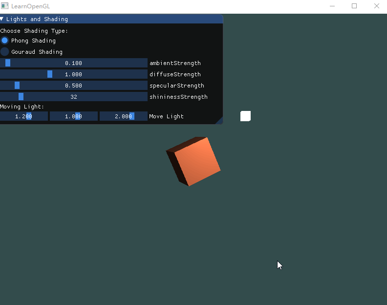
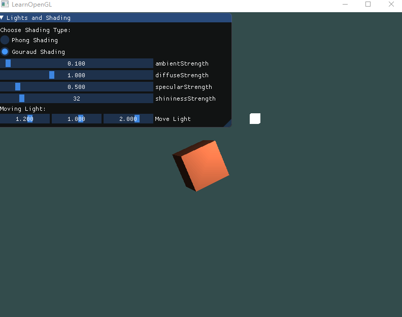
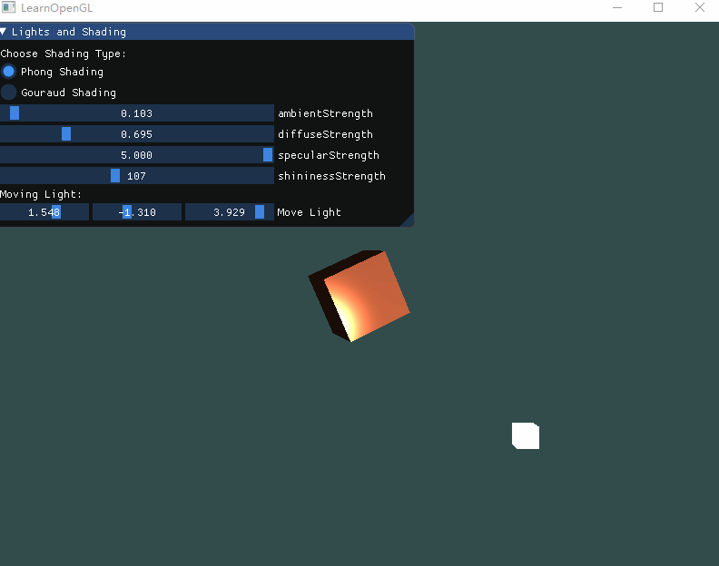

# Homework 6 - Lights and Shading

>  16340011 曾妮 HW6

## 实验要求

### Basic: 

1. 实现Phong光照模型： 
   - 场景中绘制一个cube 
   - **自己写shader**实现两种shading: Phong Shading 和 Gouraud Shading，并解释两种shading的实现原理 
   - 合理设置视点、光照位置、光照颜色等参数，使光照效果明显显示 
2. 使用GUI，使参数可调节，效果实时更改： 
   - GUI里可以切换两种shading 
   - 使用如进度条这样的控件，使ambient因子、diffuse因子、specular因子、反光度等参数可调节，光照效果实时更改 

### Bonus: 

​	当前光源为静止状态，尝试使光源在场景中来回移动，光照效果实时更改。    


## 实验过程

### 冯氏光照模型(Phong Lighting Model)

冯氏光照模型的主要结构由3个分量组成：环境(Ambient)、漫反射(Diffuse)和镜面(Specular)光照。下面这张图展示了这些光照分量看起来的样子：


- **环境光照(Ambient Lighting)**：即使在黑暗的情况下，世界上通常也仍然有一些光亮（月亮、远处的光），所以物体几乎永远不会是完全黑暗的。为了模拟这个，我们会使用一个环境光照常量，它永远会给物体一些颜色。
- **漫反射光照(Diffuse Lighting)**：模拟光源对物体的方向性影响(Directional Impact)。它是冯氏光照模型中视觉上最显著的分量。物体的某一部分越是正对着光源，它就会越亮。
- **镜面光照(Specular Lighting)**：模拟有光泽物体上面出现的亮点。镜面光照的颜色相比于物体的颜色会更倾向于光的颜色。

### 环境光照

把环境光照添加到场景里非常简单。我们用光的颜色乘以一个很小的常量环境因子，再乘以物体的颜色，然后将最终结果作为片段的颜色：

```c++
void main()
{
    float ambientStrength = 0.1;
    vec3 ambient = ambientStrength * lightColor;

    vec3 result = ambient * objectColor;
    FragColor = vec4(result, 1.0);
}
```

### 漫反射光照


 图左上方有一个光源，它所发出的光线落在物体的一个片段上。我们需要测量这个光线是以什么角度接触到这个片段的。如果光线垂直于物体表面，这束光对物体的影响会最大化（译注：更亮）。 

所以，计算漫反射光照，我们需要下面两个参数：

- 法向量：一个垂直于顶点表面的向量。

  由于我们的物体只是一个简单的立方体，我们可以手动输入这个向量，然后在顶点着色器中添加这个参数，并输出这个参数传递给片段着色器：

  ```c++
  #version 330 core
  layout (location = 0) in vec3 aPos;
  layout (location = 1) in vec3 aNormal;
  
  out vec3 Normal;
  
  void main()
  {
      gl_Position = projection * view * model * vec4(aPos, 1.0);
      Normal = aNormal;
  }
  ```

  > 但是，片段着色器里的计算都是在世界空间坐标中进行的。 所以我们也应该把法向量转换为世界左边，但这不是仅仅乘以模型矩阵就能搞定的。
  >
  > 同时，如果我们对物体进行了不等比缩放，顶点的改变会导致法向量不再垂直于表面了。因此，我们不能用这样的模型矩阵来变换法向量。 
  >
  > 
  >
  > 对于法向量，它只是一个方向向量，也就是位移不会改变它，我们只希望对它实施缩放和旋转变换。 
  >
  > 修复这个行为的诀窍是使用一个为法向量专门定制的模型矩阵。这个矩阵称之为法线矩阵(Normal Matrix)，它使用了一些线性代数的操作来移除对法向量错误缩放的影响。 
  >
  > 在顶点着色器中，我们可以使用inverse和transpose函数自己生成这个法线矩阵，这两个函数对所有类型矩阵都有效。注意我们还要把被处理过的矩阵强制转换为3×3矩阵，来保证它失去了位移属性以及能够乘以`vec3`的法向量。
  >
  > ```
  > Normal = mat3(transpose(inverse(model))) * aNormal;
  > ```

  由于本次不需要设置顶点颜色，所以也可以简单地把它像颜色参数那样处理，直接套用上次作业，将顶点数组里的颜色参数改成法向量参数即可，顶点属性指针不变，还是下面这样：

  ```c++
  glVertexAttribPointer(0, 3, GL_FLOAT, GL_FALSE, 6 * sizeof(float), (void*)0);
  glEnableVertexAttribArray(0);
  ```

- 定向的光线：作为光源的位置与片段的位置之间向量差的方向向量。为了计算这个光线，我们需要光的位置向量和片段的位置向量。

  这里，我们只需要在顶点着色器中获取片段的位置，在片段着色器中输入光源位置即可。

  片段位置只需要与model矩阵相乘，因为它是世界坐标，不需要映射到观察空间。

  ```c++
  out vec3 FragPos;  
  out vec3 Normal;
  
  void main()
  {
      gl_Position = projection * view * model * vec4(aPos, 1.0);
      FragPos = vec3(model * vec4(aPos, 1.0));
      Normal = aNormal;
  }
  ```

  然后在片段着色器中就可以利用片段与光源的位置来获得lightDir光线方向。

得到了计算漫反射所需的参数后，我们对norm和lightDir向量进行点乘，计算光源对当前片段实际的漫发射影响。结果值再乘以漫反射因子和光的颜色，得到漫反射分量。两个向量之间的角度越大，漫反射分量就会越小： 

```c++
vec3 norm = normalize(Normal);
vec3 lightDir = normalize(lightPos - FragPos);

float diff = max(dot(norm, lightDir), 0.0);
vec3 diffuse = diffuseStrength * diff * lightColor;
```

### 镜面光照

和漫反射光照一样，镜面光照也是依据光的方向向量和物体的法向量来决定的，但是它也依赖于观察方向。镜面光照是基于光的反射特性。

 

我们通过反射法向量周围光的方向来计算反射向量。然后我们计算反射向量和视线方向的角度差，如果夹角越小，那么镜面光的影响就会越大。它的作用效果就是，当我们去看光被物体所反射的那个方向的时候，我们会看到一个高光。

观察向量是镜面光照附加的一个变量，我们可以使用观察者世界空间位置和片段的位置来计算它。之后，我们计算镜面光强度，用它乘以光源的颜色，再将它加上环境光和漫反射分量。

在片段着色器中简单实现如下：

```c++
uniform vec3 viewPos;	// 摄像机位置
// ...
vec3 viewDir = normalize(viewPos - FragPos);	// 观察向量
vec3 reflectDir = reflect(-lightDir, norm);		// 反射光方向

// 计算镜面分量
float spec = pow(max(dot(viewDir, reflectDir), 0.0), shininessStrength);
vec3 specular = specularStrength * spec * lightColor;  
```

其中，`shininessStrength`指的是反光度，一个物体的反光度越高，反射光的能力越强，散射得越少，高光点就会越小。 

### 综合三种光照

以上我们计算了环境光照分量、漫反射光照分量和镜面光照分量，将三者想加并乘以物体颜色就能得到最终片段颜色：

```c++
vec3 result = (ambient + diffuse + specular) * objectColor;
FragColor = vec4(result, 1.0);
```

以上就是冯氏光照模型的Phong Shading方式，主要是在片段着色器中实现的。

Phong Shading着色器完整代码：[顶点着色器](../src/HW6_Phong.vs)；[片段着色器](../src/HW6_Phong.fs)

### Gouraud着色(Gouraud Shading) 

Gouraud Shading是在顶点着色器中实现冯氏光照模型。

它的优点是，相比片段来说，顶点要少得多，因此会更高效，所以（开销大的）光照计算频率会更低。 

然而，顶点着色器中的最终颜色值是仅仅只是那个顶点的颜色值，片段的颜色值是由插值光照颜色所得来的。结果就是这种光照看起来不会非常真实，除非使用了大量顶点。 

修改顶点着色器：

```c++
#version 330 core
layout (location = 0) in vec3 aPos;
layout (location = 1) in vec3 aNormal;

out vec3 LightingColor; 

uniform float ambientStrength;
uniform float diffuseStrength;
uniform float specularStrength; 
uniform int shininessStrength;

uniform vec3 lightPos;
uniform vec3 viewPos;
uniform vec3 lightColor;

uniform mat4 model;
uniform mat4 view;
uniform mat4 projection;

void main()
{
    gl_Position = projection * view * model * vec4(aPos, 1.0);
    
    // gouraud shading
    vec3 Position = vec3(model * vec4(aPos, 1.0));
    vec3 Normal = mat3(transpose(inverse(model))) * aNormal;
    
    // 环境光
    vec3 ambient = ambientStrength * lightColor;
  	
    // 漫反射 
    vec3 norm = normalize(Normal);
    vec3 lightDir = normalize(lightPos - Position);
    float diff = max(dot(norm, lightDir), 0.0);
    vec3 diffuse = diffuseStrength * diff * lightColor;
    
    // 镜面光
    vec3 viewDir = normalize(viewPos - Position);
    vec3 reflectDir = reflect(-lightDir, norm);  
    float spec = pow(max(dot(viewDir, reflectDir), 0.0), shininessStrength);
    vec3 specular = specularStrength * spec * lightColor;      

    LightingColor = ambient + diffuse + specular;
}
```

片段着色器：

```c++
#version 330 core
out vec4 FragColor;

in vec3 LightingColor; 

uniform vec3 objectColor;

void main()
{
   FragColor = vec4(LightingColor * objectColor, 1.0);
}
```


### 立方体&光源&ImGui

由于光源也是一个立方体，所以同被光照的立方体可以使用同一组数据，在[此处](https://learnopengl.com/code_viewer.php?code=lighting/basic_lighting_vertex_data)可以得到。不同的是，光源不需要保存法向量属性，并且光源可以使用更简单的着色器，同以往我们使用的简单着色器一样。

为了能够控制各个光照因子，和改变光源位置，我们设置如下参数：

```c++
int shading_type = 0;	// 0 - Phong Shading； 1 - Gouraud Shading
float ambientStrength = 0.1f;
float diffuseStrength = 1.0f;
float specularStrength = 0.5f;
int shininessStrength = 32;
float lightMove[] = { 1.2f, 1.0f, 2.0f };
```

然后设置ImGui控件：

```c++
ImGui::Begin("Lights and Shading");
ImGui::Text("Choose Shading Type: ");

ImGui::RadioButton("Phong Shading", &shading_type, 0);
ImGui::RadioButton("Gouraud Shading", &shading_type, 1);

ImGui::SliderFloat("ambientStrength", &ambientStrength, 0.01f, 3.0f);
ImGui::SliderFloat("diffuseStrength", &diffuseStrength, 0.01f, 3.0f);
ImGui::SliderFloat("specularStrength", &specularStrength, 0.01f, 5.0f);
ImGui::SliderInt("shininessStrength", &shininessStrength, 0, 256);

ImGui::Text("Moving Light: ");
ImGui::SliderFloat3("Move Light", lightMove, -5.0f, 5.0f);
ImGui::End();
```

根据参数改变shader：

```c++
if (shading_type == 0) {
    cubeShader = PhongShader;
}
else {
    cubeShader = GouraudShader;
}
```


## 实现效果

Phong Shading 改变因子&移动光源：



Gouraud Shading 改变因子&移动光源：



Phong Shading与Gouraud Shading切换：



感觉这两种着色器编码方式，对镜面光照分量的影响最大。

## References

- [光照颜色](https://learnopengl-cn.github.io/02%20Lighting/01%20Colors/ )

- [基础光照](https://learnopengl-cn.github.io/02%20Lighting/02%20Basic%20Lighting/ )

  