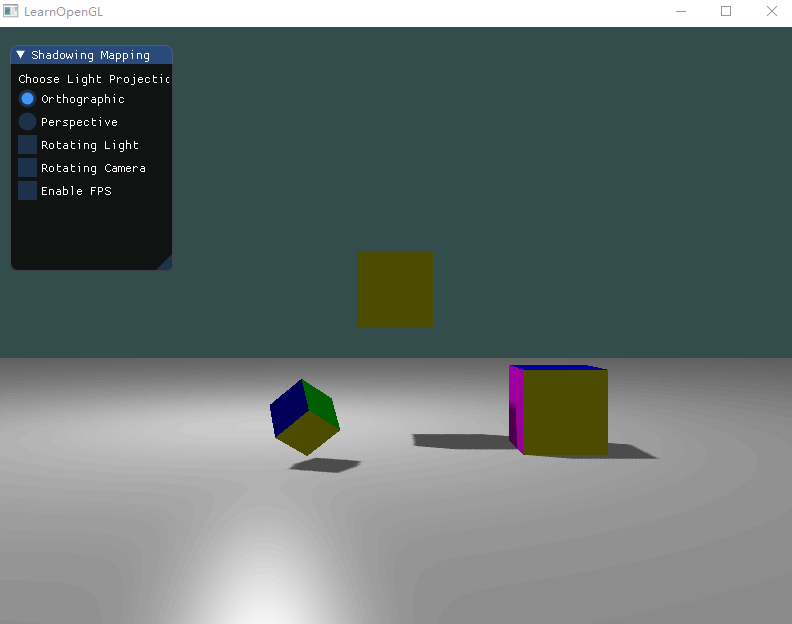

# Homework 7 - Shadowing Mapping    

> 16340011 曾妮 HW7

## 实验要求

### Basic: 

1. 实现方向光源的Shadowing Mapping: 
   - 要求场景中至少有一个object和一块平面(用于显示shadow) 光源的投影方式任选其一即可 
   - 在报告里结合代码，解释Shadowing Mapping算法 
2. 修改GUI 

### Bonus: 

1. 实现光源在正交/透视两种投影下的Shadowing Mapping 
2. 优化Shadowing Mapping (可结合References链接，或其他方法。优化方式越多越好，在报告里说明，有加分)    


## 实验过程

### Shadow Mapping 基本思路

1) 以光源视角渲染场景，得到深度图(DepthMap)，并存储为texture； 

2) 以camera视角渲染场景，使用Shadowing Mapping算法(比较当前深度值与在DepthMap Texture的深度 值)，决定某个点是否在阴影下。    


在深度缓冲里的一个值是摄像机视角下，对应于一个片元的一个0到1之间的深度值。如果我们从光源的透视图来渲染场景，并把深度值的结果储存到纹理中，我们就能对光源的透视图所见的最近的深度值进行采样。最终，深度值就会显示从光源的透视图下见到的第一个片元了。我们管储存在纹理中的所有这些深度值，叫做深度贴图（depth map）或阴影贴图。 

左侧的图片展示了一个定向光源（所有光线都是平行的）在立方体下的表面投射的阴影。通过储存到深度贴图中的深度值，我们就能找到最近点，用以决定片元是否在阴影中。我们使用一个来自光源的视图和投影矩阵来渲染场景就能创建一个深度贴图。这个投影和视图矩阵结合在一起成为一个$T$变换，它可以将任何三维位置转变到光源的可见坐标空间。 

在右边的图中我们显示出同样的平行光和观察者。我们渲染一个点$\bar{\color{red}{P}}$处的片元，需要决定它是否在阴影中。我们先得使用$T$把$\bar{\color{red}{P}}$变换到光源的坐标空间里。既然点$\bar{\color{red}{P}}$是从光的透视图中看到的，它的z坐标就对应于它的深度，例子中这个值是0.9。使用点$\bar{\color{red}{P}}$在光源的坐标空间的坐标，我们可以索引深度贴图，来获得从光的视角中最近的可见深度，结果是点$\bar{\color{green}{C}}$，最近的深度是0.4。因为索引深度贴图的结果是一个小于点$\bar{\color{red}{P}}$的深度，我们可以断定$\bar{\color{red}{P}}$被挡住了，它在阴影中了。 

### 深度贴图

第一步我们需要生成一张深度贴图(Depth Map)。 这个过程其实跟我们平时渲染一个场景相似，只不过我们不会将这个场景显示出来（或者也可以显示出来用于调试），而是将其保存成纹理，真正渲染场景时使用。

首先我们需要对帧缓冲对象进行配置：

```c++
// configure depth map FBO
// -----------------------
const unsigned int SHADOW_WIDTH = 1024, SHADOW_HEIGHT = 1024;
// 首先，我们要为渲染的深度贴图创建一个帧缓冲对象：
unsigned int depthMapFBO;
glGenFramebuffers(1, &depthMapFBO);
// create depth texture
// 然后，创建一个2D纹理，提供给帧缓冲的深度缓冲使用：
unsigned int depthMap;
glGenTextures(1, &depthMap);
glBindTexture(GL_TEXTURE_2D, depthMap);
glTexImage2D(GL_TEXTURE_2D, 0, GL_DEPTH_COMPONENT, SHADOW_WIDTH, SHADOW_HEIGHT, 0, GL_DEPTH_COMPONENT, GL_FLOAT, NULL);
glTexParameteri(GL_TEXTURE_2D, GL_TEXTURE_MIN_FILTER, GL_NEAREST);
glTexParameteri(GL_TEXTURE_2D, GL_TEXTURE_MAG_FILTER, GL_NEAREST);
// 我们宁可让所有超出深度贴图的坐标的深度范围是1.0，这样超出的坐标将永远不在阴影之中。
// 我们可以储存一个边框颜色，然后把深度贴图的纹理环绕选项设置为GL_CLAMP_TO_BORDER：
glTexParameteri(GL_TEXTURE_2D, GL_TEXTURE_WRAP_S, GL_CLAMP_TO_BORDER);
glTexParameteri(GL_TEXTURE_2D, GL_TEXTURE_WRAP_T, GL_CLAMP_TO_BORDER);
float borderColor[] = { 1.0, 1.0, 1.0, 1.0 };
glTexParameterfv(GL_TEXTURE_2D, GL_TEXTURE_BORDER_COLOR, borderColor);
// attach depth texture as FBO's depth buffer
// 生成深度贴图不太复杂。因为我们只关心深度值，我们要把纹理格式指定为GL_DEPTH_COMPONENT。
// 我们还要把纹理的高宽设置为1024：这是深度贴图的解析度。
// 把我们把生成的深度纹理作为帧缓冲的深度缓冲：
glBindFramebuffer(GL_FRAMEBUFFER, depthMapFBO);
glFramebufferTexture2D(GL_FRAMEBUFFER, GL_DEPTH_ATTACHMENT, GL_TEXTURE_2D, depthMap, 0);
glDrawBuffer(GL_NONE);
glReadBuffer(GL_NONE);
glBindFramebuffer(GL_FRAMEBUFFER, 0);
```

合理配置将深度值渲染到纹理的帧缓冲后，我们就可以开始第一步了：生成深度贴图。两个步骤的完整的渲染阶段，看起来有点像这样：

```c++
// 1. 首选渲染深度贴图
// todo：配置光源空间矩阵
glViewport(0, 0, SHADOW_WIDTH, SHADOW_HEIGHT);
glBindFramebuffer(GL_FRAMEBUFFER, depthMapFBO);
    glClear(GL_DEPTH_BUFFER_BIT);
    RenderScene(simpleDepthShader);
glBindFramebuffer(GL_FRAMEBUFFER, 0);
// 2. 像往常一样渲染场景，但这次使用深度贴图
// todo：配置阴影渲染的着色器参数
glViewport(0, 0, SCR_WIDTH, SCR_HEIGHT);
glClear(GL_COLOR_BUFFER_BIT | GL_DEPTH_BUFFER_BIT);
glActiveTexture(GL_TEXTURE0);
glBindTexture(GL_TEXTURE_2D, depthMap);
renderScene(shader);
```

这里一定要记得调用`glViewport`。因为阴影贴图经常和我们原来渲染的场景（通常是窗口解析度）有着不同的解析度，我们需要改变视口（viewport）的参数以适应阴影贴图的尺寸。如果我们忘了更新视口参数，最后的深度贴图要么太小要么就不完整。 

配置光源空间矩阵，即配置光源空间的`model`，`view`和`projection`矩阵。

`RenderScene(simpleDepthShader)`函数调用所有相关的绘制函数，并在需要的地方设置相应的模型矩阵，它的参数是一个着色器程序，这样可以在深度贴图渲染阶段和真正场景渲染阶段都重复利用这个函数，使用不同的着色器来配置。

首先，我们先贴出`simpleDepthMapping`的顶点着色器（片段着色器设为空）：

```c++
#version 330 core
layout (location = 0) in vec3 aPos;

uniform mat4 lightSpaceMatrix;
uniform mat4 model;

void main()
{
    gl_Position = lightSpaceMatrix * model * vec4(aPos, 1.0);
}
```

它很好理解，model就是场景中物体的变换矩阵，而lightSpaceMatrix就是上面提到过的变换矩阵$T$。

在渲染中，我们以光源为观察点，来得到lighProjection和lightView，其中，view可以简单的用lookAt函数获得，而lightProjection由正交或者透视得到，区别是光源是点光源还是平行光，如此得到的阴影是不同的，如下图：


所以，配置光源空间矩阵的完整代码如下：

```c++
glm::mat4 lightProjection, lightView;
glm::mat4 lightSpaceMatrix;
float near_plane = 1.0f, far_plane = 7.5f;
if (light_projection_type == 1) {
    lightProjection = glm::perspective(glm::radians(45.0f), (GLfloat)SHADOW_WIDTH / (GLfloat)SHADOW_HEIGHT, near_plane, far_plane); 
}
else {
    lightProjection = glm::ortho(-10.0f, 10.0f, -10.0f, 10.0f, near_plane, far_plane);
}
lightView = glm::lookAt(lightPos, glm::vec3(0.0f), glm::vec3(0.0, 1.0, 0.0));
lightSpaceMatrix = lightProjection * lightView;
// render scene from light's point of view
simpleDepthShader.use();
simpleDepthShader.setMat4("lightSpaceMatrix", lightSpaceMatrix);
```

### 渲染阴影

正确地生成深度贴图以后我们就可以开始生成阴影了。 这段代码在像素着色器中执行，用来检验一个片元是否在阴影之中，不过我们在顶点着色器中进行光空间的变换： 

```c++
#version 330 core
layout (location = 0) in vec3 aPos;
layout (location = 1) in vec3 aNormal;
layout (location = 2) in vec3 aColor;

out vec2 TexCoords;

out VS_OUT {
    vec3 FragPos;
    vec3 Normal;
    vec3 ourColor;
    vec4 FragPosLightSpace;
} vs_out;

uniform mat4 projection;
uniform mat4 view;
uniform mat4 model;
uniform mat4 lightSpaceMatrix;

void main()
{
    vs_out.FragPos = vec3(model * vec4(aPos, 1.0));
    vs_out.Normal = transpose(inverse(mat3(model))) * aNormal;
    vs_out.ourColor = aColor;
    vs_out.FragPosLightSpace = lightSpaceMatrix * vec4(vs_out.FragPos, 1.0);
    gl_Position = projection * view * model * vec4(aPos, 1.0);
}
```

这儿的新的地方是FragPosLightSpace这个输出向量。我们用同一个lightSpaceMatrix，把世界空间顶点位置转换为光空间。顶点着色器传递一个普通的经变换的世界空间顶点位置vs_out.FragPos和一个光空间的vs_out.FragPosLightSpace给像素着色器。 

片段着色器使用Phong光照模型渲染场景。我们接着计算出一个shadow值，当fragment在阴影中时是1.0，在阴影外是0.0。然后，diffuse和specular颜色会乘以这个阴影元素。由于阴影不会是全黑的（由于散射），我们把ambient分量从乘法中剔除。 

```c++
#version 330 core
out vec4 FragColor;

in VS_OUT {
    vec3 FragPos;
    vec3 Normal;
    vec3 ourColor;
    vec4 FragPosLightSpace;
} fs_in;

uniform sampler2D shadowMap;

uniform vec3 lightPos;
uniform vec3 viewPos;

float ShadowCalculation(vec4 fragPosLightSpace)
{
    // 执行透视除法
    vec3 projCoords = fragPosLightSpace.xyz / fragPosLightSpace.w;
    // 变换到[0,1]的范围
    projCoords = projCoords * 0.5 + 0.5;
    // 取得最近点的深度(使用[0,1]范围下的fragPosLight当坐标)
    float closestDepth = texture(shadowMap, projCoords.xy).r; 
    // 取得当前片元在光源视角下的深度
    float currentDepth = projCoords.z;
    // 检查当前片元是否在阴影中
    float shadow = currentDepth > closestDepth  ? 1.0 : 0.0;

    return shadow;
}

void main()
{           
    vec3 color = fs_in.ourColor;
    vec3 normal = normalize(fs_in.Normal);
    vec3 lightColor = vec3(0.5);
    // ambient
    vec3 ambient = 0.3 * color;
    // diffuse
    vec3 lightDir = normalize(lightPos - fs_in.FragPos);
    float diff = max(dot(lightDir, normal), 0.0);
    vec3 diffuse = diff * lightColor;
    // specular
    vec3 viewDir = normalize(viewPos - fs_in.FragPos);
    vec3 reflectDir = reflect(-lightDir, normal);
    float spec = 0.0;
    vec3 halfwayDir = normalize(lightDir + viewDir);  
    spec = pow(max(dot(normal, halfwayDir), 0.0), 64.0);
    vec3 specular = spec * lightColor;    
    // calculate shadow
    float shadow = ShadowCalculation(fs_in.FragPosLightSpace);                      
    vec3 lighting = (ambient + (1.0 - shadow) * (diffuse + specular)) * color;    
    
    FragColor = vec4(lighting, 1.0);
}
```

`ShadowCalculation(vec4 fragPosLightSpace)`利用该点在光源空间中的位置来计算阴影。最后，我们把diffuse和specular乘以(1-shadow)，这表示这个片元有多大成分不在阴影中。 

以上，阴影贴图就完成了。

### object & plane & ImGui

平面是一块白色的平面：

```c++
// plane
float planeVertices[] = {
    // positions            // normals			// colors
    25.0f, -0.5f,  25.0f,  0.0f, 1.0f, 0.0f,   1.0f, 1.0f, 1.0f,
    -25.0f, -0.5f,  25.0f,  0.0f, 1.0f, 0.0f,   1.0f, 1.0f, 1.0f,
    -25.0f, -0.5f, -25.0f,  0.0f, 1.0f, 0.0f,   1.0f, 1.0f, 1.0f,

    25.0f, -0.5f,  25.0f,  0.0f, 1.0f, 0.0f,	1.0f, 1.0f, 1.0f,
    -25.0f, -0.5f, -25.0f,  0.0f, 1.0f, 0.0f,   1.0f, 1.0f, 1.0f,
    25.0f, -0.5f, -25.0f,  0.0f, 1.0f, 0.0f,	1.0f, 1.0f, 1.0f
};
// plane VAO
unsigned int planeVBO;
glGenVertexArrays(1, &planeVAO);
glGenBuffers(1, &planeVBO);
glBindVertexArray(planeVAO);
glBindBuffer(GL_ARRAY_BUFFER, planeVBO);
glBufferData(GL_ARRAY_BUFFER, sizeof(planeVertices), planeVertices, GL_STATIC_DRAW);
glEnableVertexAttribArray(0);
glVertexAttribPointer(0, 3, GL_FLOAT, GL_FALSE, 9 * sizeof(float), (void*)0);
glEnableVertexAttribArray(1);
glVertexAttribPointer(1, 3, GL_FLOAT, GL_FALSE, 9 * sizeof(float), (void*)(3 * sizeof(float)));
glEnableVertexAttribArray(2);
glVertexAttribPointer(2, 3, GL_FLOAT, GL_FALSE, 9 * sizeof(float), (void*)(6 * sizeof(float)));
glBindVertexArray(0);
```

立方体有三个，不过绑定顶点数据是一样的，在`renderCube`中实现：

```c++
// renderCube() renders a 1x1 3D cube in NDC.
// -------------------------------------------------
unsigned int cubeVAO = 0;
unsigned int cubeVBO = 0;
void renderCube()
{
    // initialize (if necessary)
    if (cubeVAO == 0)
    {
        float vertices[] = {
           // 36个立方体顶点数据：position, normal, color    
        };
        glGenVertexArrays(1, &cubeVAO);
        glGenBuffers(1, &cubeVBO);
        // fill buffer
        glBindBuffer(GL_ARRAY_BUFFER, cubeVBO);
        glBufferData(GL_ARRAY_BUFFER, sizeof(vertices), vertices, GL_STATIC_DRAW);
        // link vertex attributes
        glBindVertexArray(cubeVAO);
        glEnableVertexAttribArray(0);
        glVertexAttribPointer(0, 3, GL_FLOAT, GL_FALSE, 9 * sizeof(float), (void*)0);
        glEnableVertexAttribArray(1);
        glVertexAttribPointer(1, 3, GL_FLOAT, GL_FALSE, 9 * sizeof(float), (void*)(3 * sizeof(float)));
        glEnableVertexAttribArray(2);
        glVertexAttribPointer(2, 3, GL_FLOAT, GL_FALSE, 9 * sizeof(float), (void*)(6 * sizeof(float)));
        glBindBuffer(GL_ARRAY_BUFFER, 0);
        glBindVertexArray(0);
    }
    // render Cube
    glBindVertexArray(cubeVAO);
    glDrawArrays(GL_TRIANGLES, 0, 36);
    glBindVertexArray(0);
}
```

前面已经设置好了view和projection矩阵，所以在`renderScene(const Shader &shader)`函数中只需要对每个object的model进行设置。

```c++
// renders the 3D scene
// --------------------
void renderScene(const Shader &shader)
{
	// floor
	glm::mat4 model = glm::mat4(1.0f);
	shader.setMat4("model", model);
	glBindVertexArray(planeVAO);
	glDrawArrays(GL_TRIANGLES, 0, 6);
	// cubes
	model = glm::mat4(1.0f);
	model = glm::translate(model, glm::vec3(0.0f, 1.5f, 0.0));
	model = glm::scale(model, glm::vec3(0.5f));
	shader.setMat4("model", model);
	renderCube();
	model = glm::mat4(1.0f);
	model = glm::translate(model, glm::vec3(2.0f, 0.0f, 1.0));
	model = glm::scale(model, glm::vec3(0.5f));
	shader.setMat4("model", model);
	renderCube();
	model = glm::mat4(1.0f);
	model = glm::translate(model, glm::vec3(-1.0f, 0.0f, 2.0));
	model = glm::rotate(model, glm::radians(60.0f), glm::normalize(glm::vec3(1.0, 0.0, 1.0)));
	model = glm::scale(model, glm::vec3(0.25));
	shader.setMat4("model", model);
	renderCube();
}
```

ImGui用于控制光源投影是正交还是透视，以及是否旋转光源或者摄像机：

```c++
ImGui::Begin("Shadowing Mapping");
ImGui::Text("Choose Light Projection Type: ");

ImGui::RadioButton("Orthographic", &light_projection_type, 0);
ImGui::RadioButton("Perspective", &light_projection_type, 1);

ImGui::Checkbox("Rotating Light", &rotate_light);
ImGui::Checkbox("Rotating Camera", &rotate_camera);
ImGui::Checkbox("Enable FPS", &enable_FPS);
ImGui::End();
```

旋转光源：

```c++
if (rotate_light) {
    // change light position over time
    lightPos.x = sin(glfwGetTime()) * 3.0f;
    lightPos.z = cos(glfwGetTime()) * 2.0f;
    lightPos.y = 5.0 + cos(glfwGetTime()) * 1.0f;
}
else {
    lightPos = glm::vec3(-2.0f, 4.0f, -1.0f);
}
```

旋转摄像机：

```c++
if (rotate_camera) {
    enable_FPS = false;
    float radius = 10.0f;
    float camX = sin(glfwGetTime()) * radius;
    float camZ = cos(glfwGetTime()) * radius;
    view = glm::lookAt(glm::vec3(camX, 1.0, camZ), glm::vec3(0.0, 0.0, 0.0), glm::vec3(0.0, 1.0, 0.0));
}
else {
    view = camera.GetViewMatrix();
}
```

以及，是否开启FPS模式，开启时，我们才会将鼠标得到偏移量传递给camera进行处理。

```c++
if (enable_FPS) camera.ProcessMouseMovement(xoffset, yoffset);
```


### 阴影优化

**阴影失真**

上面简单的阴影渲染得到的阴影，放大看就会看到明显的线条样式，大概像这样：

 

用下图能够很简单的解释阴影失真的原因：

 

因为阴影贴图受限于解析度，在距离光源比较远的情况下，多个片元可能从深度贴图的同一个值中去采样。图片每个斜坡代表深度贴图一个单独的纹理像素。你可以看到，多个片元从同一个深度值进行采样。 

虽然很多时候没问题，但是当光源以一个角度朝向表面的时候就会出问题，这种情况下深度贴图也是从一个角度下进行渲染的。多个片元就会从同一个斜坡的深度纹理像素中采样，有些在地板上面，有些在地板下面；这样我们所得到的阴影就有了差异。因为这个，有些片元被认为是在阴影之中，有些不在，由此产生了图片中的条纹样式。

我们可以用一个叫做**阴影偏移**（shadow bias）的技巧来解决这个问题，我们简单的对表面的深度（或深度贴图）应用一个偏移量，这样片元就不会被错误地认为在表面之下了。

 

使用了偏移量后，所有采样点都获得了比表面深度更小的深度值，这样整个表面就正确地被照亮，没有任何阴影。 

实现方式：在片段着色器的计算阴影函数中添加一个偏移量bias：

```c++
vec3 normal = normalize(fs_in.Normal);
vec3 lightDir = normalize(lightPos - fs_in.FragPos);
float bias = max(0.05 * (1.0 - dot(normal, lightDir)), 0.005);
// 检查当前片元是否在阴影中
float shadow = currentDepth - bias > closestDepth  ? 1.0 : 0.0;
```

**采样过多**

光的视锥不可见的区域一律被认为是处于阴影中，不管它真的处于阴影之中。出现这个状况是因为超出光的视锥的投影坐标比1.0大，这样采样的深度纹理就会超出他默认的0到1的范围。根据纹理环绕方式，我们将会得到不正确的深度结果，它不是基于真实的来自光源的深度值。 

光照有一个区域，超出该区域就成为了阴影；这个区域实际上代表着深度贴图的大小，这个贴图投影到了地板上。发生这种情况的原因是我们之前将深度贴图的环绕方式设置成了GL_REPEAT。

我们宁可让所有超出深度贴图的坐标的深度范围是1.0，这样超出的坐标将永远不在阴影之中。我们可以储存一个边框颜色，然后把深度贴图的纹理环绕选项设置为GL_CLAMP_TO_BORDER：

```c++
glTexParameteri(GL_TEXTURE_2D, GL_TEXTURE_WRAP_S, GL_CLAMP_TO_BORDER);
glTexParameteri(GL_TEXTURE_2D, GL_TEXTURE_WRAP_T, GL_CLAMP_TO_BORDER);
GLfloat borderColor[] = { 1.0, 1.0, 1.0, 1.0 };
glTexParameterfv(GL_TEXTURE_2D, GL_TEXTURE_BORDER_COLOR, borderColor);
```

现在如果我们采样深度贴图0到1坐标范围以外的区域，纹理函数总会返回一个1.0的深度值，阴影值为0.0。

仍有一部分是黑暗区域。那里的坐标超出了光的正交视锥的远平面。你可以看到这片黑色区域总是出现在光源视锥的极远处。

当一个点比光的远平面还要远时，它的投影坐标的z坐标大于1.0。这种情况下，GL_CLAMP_TO_BORDER环绕方式不起作用，因为我们把坐标的z元素和深度贴图的值进行了对比；它总是为大于1.0的z返回true。

解决这个问题也很简单，只要投影向量的z坐标大于1.0，我们就把shadow的值强制设为0.0：

```c++
float ShadowCalculation(vec4 fragPosLightSpace)
{
    [...]
    if(projCoords.z > 1.0)
        shadow = 0.0;

    return shadow;
}
```

检查远平面，并将深度贴图限制为一个手工指定的边界颜色，就能解决深度贴图采样超出的问题。

**PCF消除阴影锯齿**

放大阴影，我们会看到锯齿：

 

这是由于深度贴图有一个固定的解析度，多个片元对应于一个纹理像素。结果就是多个片元会从深度贴图的同一个深度值进行采样，这几个片元便得到的是同一个阴影，这就会产生锯齿边。 

我们这里利用一种解决方案叫做PCF（percentage-closer filtering），这是一种多个不同过滤方式的组合，它产生柔和阴影，使它们出现更少的锯齿块和硬边。核心思想是从深度贴图中多次采样，每一次采样的纹理坐标都稍有不同。每个独立的样本可能在也可能不再阴影中。所有的次生结果接着结合在一起，进行平均化，我们就得到了柔和阴影。

一个简单的PCF的实现是简单的从纹理像素四周对深度贴图采样，然后把结果平均起来：

```c++
float shadow = 0.0;
vec2 texelSize = 1.0 / textureSize(shadowMap, 0);
for(int x = -1; x <= 1; ++x)
{
    for(int y = -1; y <= 1; ++y)
    {
        float pcfDepth = texture(shadowMap, projCoords.xy + vec2(x, y) * texelSize).r; 
        shadow += currentDepth - bias > pcfDepth ? 1.0 : 0.0;        
    }    
}
shadow /= 9.0;
```

这个textureSize返回一个给定采样器纹理的0级mipmap的vec2类型的宽和高。用1除以它返回一个单独纹理像素的大小，我们用以对纹理坐标进行偏移，确保每个新样本，来自不同的深度值。这里我们采样得到9个值，它们在投影坐标的x和y值的周围，为阴影阻挡进行测试，并最终通过样本的总数目将结果平均化。

使用更多的样本，更改texelSize变量，你就可以增加阴影的柔和程度。下面你可以看到应用了PCF的阴影：


从稍微远一点的距离看去，阴影效果好多了，也不那么生硬了。如果你放大，仍会看到阴影贴图解析度的不真实感，但通常对于大多数应用来说效果已经很好了。

## 实现效果

光源正交投影：


光源透视投影：


正交透视变换：




## References

- [阴影映射](https://learnopengl-cn.github.io/05%20Advanced%20Lighting/03%20Shadows/01%20Shadow%20Mapping)
- [Tutorial 16 : Shadow mapping](http://www.opengl-tutorial.org/intermediate-tutorials/tutorial-16-shadow-mapping)