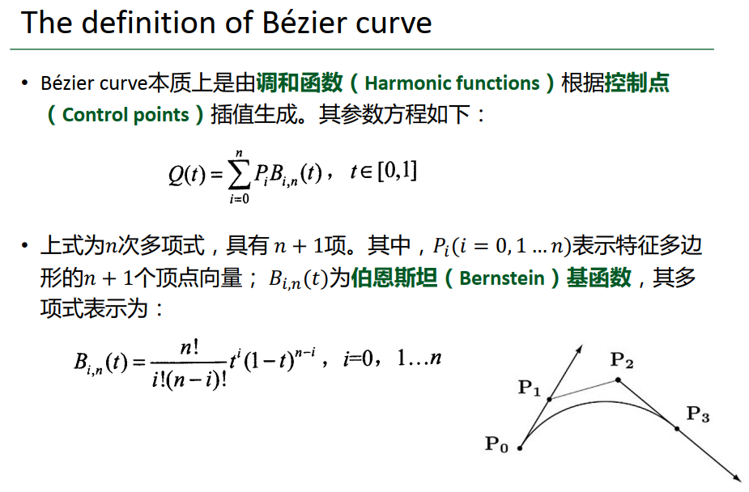

# Homework 8 - Bezier Curve

> 16340011 曾妮 HW8

## 实验要求

本次作业要求大家实现一个Bezier Curve的绘制小工具。此工具可以接受鼠标输入。    

### Basic: 

1. 用户能通过左键点击添加Bezier曲线的控制点，右键点击则对当前添加的最后一个控制点进行消除 

2. 工具根据鼠标绘制的控制点实时更新Bezier曲线。 

*Hint:* 大家可查询捕捉mouse移动和点击的函数方法    

### Bonus: 

1. 可以动态地呈现Bezier曲线的生成过程。    


## 实验过程

### Bezier Curves介绍



### 实现流程

**一些全局变量**

```c++
// 窗口大小
const unsigned int SCR_WIDTH = 800;
const unsigned int SCR_HEIGHT = 600;

int controlPoints_num; 				// 控制点数量
glm::vec2 controlPoints[101];		// 控制点
glm::vec2 tempPoints[300];			// 备份点
glm::vec2 middlePoints[300];		// 由控制点生成的中间点
float vertices[4002];				// 顶点
int vertices_num = 0;				// 顶点数量
int fac = 1;						// 阶乘index
long long int facArray[105];		// 存储阶乘数
float frame;						// 控制动态点
```

**添加鼠标点击回调函数，添加控制点**

```c++
//绑定
glfwSetMouseButtonCallback(window, mouse_button_callback);
//声明
void mouse_button_callback(GLFWwindow* window, int button, int action, int mods) {
	if (button == GLFW_MOUSE_BUTTON_LEFT && action == GLFW_PRESS) {
		double xpos, ypos;
        // 获取当前鼠标位置
		glfwGetCursorPos(window, &xpos, &ypos);
		if (controlPoints_num < 21) {
			controlPoints[controlPoints_num] = glm::vec2(xpos, ypos);
			controlPoints_num++;
		}
	}
	if (button == GLFW_MOUSE_BUTTON_RIGHT && action == GLFW_PRESS) {
		if (controlPoints_num > 0) {
			controlPoints_num--;
		}
	}
}
```

**将点添加到顶点集**

需要将窗口大小的坐标转换为[-1, 1]的范围

```c++
void addVertices(glm::vec2 point) {
	vertices[vertices_num * 2] = (point.x / SCR_WIDTH) * 2 - 1;
	vertices[vertices_num * 2 + 1] = -((point.y / SCR_HEIGHT) * 2 - 1);
	vertices_num++;
}
```

**存储阶乘数**

因为阶乘数会被反复利用，所以提前生成并存储在数组中方便调用。

```c++
int Factorial(int x) {
	if (x > 104) {
		return 1;
	}
	for (; fac <= x; fac++) {
		facArray[fac] = facArray[fac - 1] * fac;
	}
	return facArray[x];
}
```

**Bernstein基函数**
$$
B_{i,n}(t) = \frac{n!}{i!(n-i)!} t^i(1-t)^{n-i}, i = 0, 1,...,n
$$

```c++
float Bernstein(int i, int n, float t) {
	long long int a = Factorial(i) * Factorial(n - i);
	float res = Factorial(n) / a;
	res *= pow(t, i) * pow(1 - t, n - i);
	return res;
}
```

**渲染函数**

用于渲染绘制点和线，其中曲线的绘制方式也是`GL_POINTS`，直线的绘制方式是`GL_LINE_STRIP`。

```c++
void renderPointsAndLines(int size, bool ifLine, bool ifClear) {
	if (vertices_num <= 0)
	{
		return;
	}
	unsigned int VBO, VAO;
	glGenVertexArrays(1, &VAO);
	glGenBuffers(1, &VBO);
	glBindVertexArray(VAO);
	glBindBuffer(GL_ARRAY_BUFFER, VBO);
	glPointSize(size);    // 设置点的大小
	glBufferData(GL_ARRAY_BUFFER, 2 * sizeof(float) * vertices_num, vertices, GL_STREAM_DRAW);
	glVertexAttribPointer(0, 2, GL_FLOAT, GL_FALSE, 0, (void*)0);
	glEnableVertexAttribArray(0);
	glBindBuffer(GL_ARRAY_BUFFER, 0);
	glDrawArrays(GL_POINTS, 0, vertices_num);

	if (ifLine)
	{
		glDrawArrays(GL_LINE_STRIP, 0, vertices_num);
	}
	glBindVertexArray(0);

	glDeleteVertexArrays(1, &VAO);
	glDeleteBuffers(1, &VBO);

	if (ifClear)
	{
		vertices_num = 0;
	}
}
```

**循环渲染**

1. 绘制控制点

   ```c++
   // draw points
   for (int i = 0; i < controlPoints_num; i++)
   {
       addVertices(controlPoints[i]);
   }
   renderPointsAndLines(5, true, false);
   ```

2. 绘制曲线

   ```c++
   // draw curves
   if (controlPoints_num > 1) {
       for (float t = 0; t < 1; t += 0.001) {
           glm::vec2 p = controlPoints[0] * Bernstein(0, controlPoints_num - 1, t);
           for (int i = 1; i < controlPoints_num; i++) {
               p = p + controlPoints[i] * Bernstein(i, controlPoints_num - 1, t);
           }
           addVertices(p);
       }
       renderPointsAndLines(1);
   }
   ```

3. 动态绘制中间点和直线

    

   中间点通过设置frame来获取，然后调用渲染函数来绘制中间点和直线。

   ```c++
   // draw lines
   if (controlPoints_num > 1) {
       frame += 0.001;
       if (frame > 1) {
           frame = 0;
       }
       float t = frame;
       int mCount = controlPoints_num;
       for (int i = 0; i < controlPoints_num; i++) {
           middlePoints[i] = controlPoints[i];
       }
       while (mCount > 1) {
           int nCount = 0;
           for (int i = 0; i < mCount - 1; i++) {
               glm::vec2 p = middlePoints[i] * (1 - t) + middlePoints[i + 1] * t;
               tempPoints[nCount] = p;
               nCount++;
               addVertices(p);
           }
           renderPointsAndLines(5, true);
           for (int i = 0; i < nCount; i++) {
               middlePoints[i] = tempPoints[i];
           }
           mCount = nCount;
       }
       glm::vec2 p = controlPoints[0] * Bernstein(0, controlPoints_num - 1, t);
       for (int i = 1; i < controlPoints_num; i++) {
           p = p + controlPoints[i] * Bernstein(i, controlPoints_num - 1, t);
       }
       addVertices(p);
       renderPointsAndLines();
   }
   ```


## 实现效果


## References

- [阴影映射](https://learnopengl-cn.github.io/05%20Advanced%20Lighting/03%20Shadows/01%20Shadow%20Mapping)
- [Tutorial 16 : Shadow mapping](http://www.opengl-tutorial.org/intermediate-tutorials/tutorial-16-shadow-mapping)